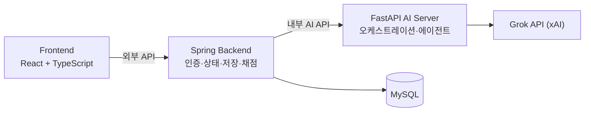

# EduPilot

> PDF 강의 자료를 기반으로 AI 페이지 설명, 질의응답, 퀴즈, 채점, 오개념 교정을 제공하는 AI 학습 튜터 시스템

| 항목 | 내용 |
| --- | --- |
| 문서 상태 | 설계 초안 — 구현 시작 전 |
| 마지막 갱신 | 2026-07-21 |
| 기준 아키텍처 | Frontend → Spring Backend → FastAPI AI Server → Grok API |
| 현재 저장소 상태 | 문서화 단계이며 애플리케이션 코드는 아직 생성하지 않음 |

## 1. 프로젝트 소개

EduPilot은 학습자가 PDF 강의 자료를 보면서 AI 튜터와 상호작용할 수 있는 학습 보조 플랫폼입니다. 학습자는 페이지별 설명을 받고, 현재 페이지에 관해 질문하며, 학습 범위에 맞는 퀴즈를 풀고, 오답 진단과 교정을 받을 수 있습니다.

서비스가 해결하려는 핵심 문제는 정적인 PDF 학습에서 발생하는 세 가지 단절입니다.

- 이해하기 어려운 내용을 즉시 설명받기 어렵다.
- 학습 도중 생긴 질문을 현재 페이지 문맥에 맞게 해결하기 어렵다.
- 학습 후 이해도를 점검하고 반복되는 오개념을 교정하기 어렵다.

주요 사용자는 PDF 자료를 바탕으로 자기주도 학습을 하는 **학습자**입니다. 자료와 사용자를 관리하는 **관리자**는 MVP의 보조 사용자입니다.

## 2. MVP 기능

- 회원가입, 로그인, 내 정보 조회, 회원 탈퇴
- PDF 학습 자료 업로드, 조회 및 삭제
- PDF 기반 학습 세션 생성, 조회, 종료
- 현재 페이지 이동 및 세션 상태 동기화
- 현재 페이지 기반 AI 설명
- 현재 페이지와 QA 문맥 기반 질의응답
- AI 설명·QA 응답 실시간 스트리밍
- 객관식, OX, 단답형, 서술형 퀴즈 생성
- MCQ/OX 서버 채점, 단답형/서술형 AI 채점
- 저득점 시 오개념 진단 질문 및 짧은 교정 설명
- 퀴즈 평가 기록과 반복 패턴 기반 학습자 메모리 승격·개인화 반영

MVP에서 제외하거나 후순위로 두는 기능은 실시간 화상 강의, 교사-학생 실시간 채팅, 결제, 복잡한 관리자 통계, 모든 LLM 출력의 완전 자동 사실 검증입니다. `TEACHER`, `Course`, `Lecture`, `Assignment`, `Notification` 도메인은 필요성 검토 후 별도 범위로 확정합니다.

## 3. 시스템 구조



### 책임 경계

| 구성 요소 | 책임 |
| --- | --- |
| Frontend | 로그인, PDF 뷰어, 채팅/퀴즈/진단 UI, 스트리밍 표시 |
| Spring Backend | 인증·인가, 사용자/자료/세션 관리, 상태와 기록의 기준 저장소, MCQ/OX 채점, FastAPI 호출, 외부 API 제공 |
| FastAPI AI Server | ContextBuilder, Orchestrator, Policy/Verifier, ToolDispatcher, 전문 에이전트 실행, Grok 연동 |
| MySQL | 사용자, 자료, 세션, 메시지, 퀴즈, 진단, 교정, 학습자 메모리 영속화 |

핵심 원칙은 다음과 같습니다.

- Frontend는 FastAPI를 직접 호출하지 않고 Spring API만 호출합니다.
- Spring은 데이터와 세션 상태의 기준 서버이며, **자유 학습 턴**(질문, 설명, 퀴즈 유형 선택, 진단 답변)에서는 어떤 AI 에이전트를 호출할지 판단하지 않고 `/internal/ai/turn` 단일 진입점으로 이벤트를 전달합니다. 단, **퀴즈 제출 후의 결정적 후처리**(SHORT/ESSAY 채점 → 내부 평가 → 저득점 시 진단)는 이벤트 타입과 점수 기준에 따라 Spring이 전용 내부 API를 순차 호출합니다. 이는 판단이 아니라 규칙 실행입니다.
- FastAPI는 AI 계획과 생성 결과를 담당하고, 비즈니스 영속 데이터의 최종 소유자가 되지 않습니다.
- MCQ/OX는 Spring에서 즉시 채점하고, 단답형/서술형은 FastAPI의 GraderAgent가 채점합니다.
- 단일 질문이나 퀴즈 결과만으로 장기 학습자 메모리를 확정하지 않습니다.

자세한 책임과 데이터 흐름은 [시스템 아키텍처](docs/architecture.md)를 참고합니다.

## 4. 기술 스택

### 확정

| 영역 | 기술 |
| --- | --- |
| Frontend | React, TypeScript, Vite |
| Backend | Java 21, Spring Boot 4.1.x, Spring Security, Spring Data JPA, JWT, Flyway |
| AI Server | Python 3.14.x, FastAPI, Grok API (전 에이전트 공통 grok-4.5 고정 — DEC-002) |
| Database | MySQL |
| Infra | Docker, Docker Compose, GitHub Actions, AWS |
| Backend Test | JUnit 5, MockMvc, `@SpringBootTest` |
| API 문서 | Swagger UI, OpenAPI, springdoc-openapi |

### 구현 전 확정 필요

- Frontend 상태 관리/UI 라이브러리
- 테스트 보조 도구와 Testcontainers 도입 여부

확정된 항목: Python 3.14.x·grok-4.5 고정(DEC-002 v2), PDF 저장소·추출 책임(DEC-005·006), AWS 구성 — 단일 EC2 + Docker Compose + Nginx HTTPS(DEC-019), 라이선스 — 비공개 유지(DEC-020).

결정 대기 항목은 [결정 대기 목록](docs/decisions.md)에서 관리합니다.

## 5. 예정 로컬 구성

> 아래 주소와 실행 순서는 프로젝트 초기 세팅 후 적용할 **예정값**입니다. 현재 저장소에는 실행 가능한 애플리케이션이 없습니다.

```text
Frontend:          http://localhost:5173
Spring Backend:    http://localhost:8080
FastAPI AI Server: http://localhost:8000
MySQL:             localhost:3306
```

전체 통합 환경의 예정 실행 순서는 `MySQL → FastAPI → Spring → Frontend`입니다. 개발 중에는 필요한 경계만 실행합니다.

| 작업 | 필요한 구성 요소 |
| --- | --- |
| Frontend 화면 개발 | Frontend |
| FE-Spring 계약 테스트 | Frontend + Spring + MySQL |
| Spring-FastAPI 연동 테스트 | Spring + FastAPI + MySQL |
| 전체 AI 흐름 테스트 | 모든 구성 요소 |

## 6. 환경 변수 원칙

민감 정보는 저장소에 커밋하지 않습니다. 실제 값은 로컬 전용 환경 파일, 서버 환경 변수, GitHub Actions Secrets 등으로 관리합니다.

예정 환경 변수:

```text
# Frontend
VITE_API_BASE_URL

# Spring Backend
EDUPILOT_DB_URL
EDUPILOT_DB_USERNAME
EDUPILOT_DB_PASSWORD
EDUPILOT_AI_BASE_URL
EDUPILOT_JWT_SECRET
EDUPILOT_INTERNAL_TOKEN
EDUPILOT_CORS_ALLOWED_ORIGINS
EDUPILOT_UPLOAD_MAX_MB
EDUPILOT_QUIZ_PASS_RATIO

# FastAPI AI Server
XAI_API_KEY
MODEL_NAME
```

예제 파일에는 가짜 값만 두며 `.env`, 실제 자격 증명, 운영 접속 정보는 커밋하지 않습니다.

## 7. 주요 API 초안

```text
POST   /api/auth/signup
POST   /api/auth/login
GET    /api/users/me
DELETE /api/users/me

POST   /api/materials
GET    /api/materials
GET    /api/materials/{materialId}
DELETE /api/materials/{materialId}
GET    /api/materials/{materialId}/pages/{pageNumber}

POST   /api/sessions
GET    /api/sessions
GET    /api/sessions/{sessionId}
DELETE /api/sessions/{sessionId}
PATCH  /api/sessions/{sessionId}/page
POST   /api/sessions/{sessionId}/turns
GET    /api/sessions/{sessionId}/messages
GET    /api/sessions/{sessionId}/quizzes
POST   /api/sessions/{sessionId}/complete

GET    /api/quizzes/{quizId}
POST   /api/quizzes/{quizId}/submit
GET    /api/users/me/memory?materialId={materialId}
```

이 목록은 계약 초안입니다. 구현이 시작되면 OpenAPI 문서를 API 계약의 실행 가능한 기준으로 사용하고 [API 명세](docs/api-spec.md)와 함께 변경합니다.

## 8. 문서 안내

| 문서 | 목적 | Frontend 필수 |
| --- | --- | :---: |
| [문서 인덱스](docs/README.md) | 문서 상태와 우선순위 | O |
| [프로젝트 목표](docs/project-goals.md) | 문제, 사용자, MVP, 제외 범위 | O |
| [요구사항 명세](docs/requirements.md) | 무엇을 만들 것인가 | O |
| [기능 명세](docs/feature-spec.md) | 기능별 흐름, 정책, 예외 | O |
| [화면-API 매핑](docs/screen-api-map.md) | 화면에서 어떤 API를 언제 호출하는가 | O |
| [API 명세](docs/api-spec.md) | 외부/내부 API 계약 초안 | O |
| [에러 코드](docs/error-code.md) | 공통 에러 응답과 처리 기준 | O |
| [시스템 아키텍처](docs/architecture.md) | 서버 책임과 통신 흐름 | 참고 |
| [도메인 모델](docs/domain-model.md) | 엔티티 관계와 비즈니스 규칙 | 참고 |
| [데이터베이스](docs/database.md) | 테이블, 제약조건, 인덱스 초안 | 참고 |
| [백엔드 실행 계획](docs/backend-plan.md) | Spring 작업 순서와 검증 기준 | 참고 |
| [백엔드 컨벤션](docs/backend-convention.md) | 코드 작성 규칙 | 참고 |
| [Git Flow](docs/git-flow.md) | 브랜치와 PR 운영 | O |
| [이슈·PR 협업 작업 흐름](docs/issue-workflow.md) | 부모·하위 이슈, 라벨, 템플릿, PR 연결 | O |
| [GitHub Epic 초안](docs/issues/README.md) | 실제 GitHub에 복사할 8개 간결한 Epic | O |
| [상세 작업 분해 계획](docs/issue-plan.md) | 기능별 흐름·예외·구현 작업 참고 | 참고 |
| [Definition of Done](docs/definition-of-done.md) | 기능 완료 기준 | O |
| [에이전트 시스템 명세](docs/agent-system-spec.md) | FastAPI 팀 구현 참고 계약 | 참고 |
| [AI 연동 계약](docs/ai-integration-contract.md) | Spring–FastAPI 내부 계약 세부 (작성 중 — AI 담당) | 참고 |
| [AI 테스트 전략](docs/test-strategy.md) | golden 세트·표류 감지·TTFT 검증 (작성 중 — AI 담당) | 참고 |
| [협업 가이드](CONTRIBUTING.md) | 팀 공통 기여 규칙 | O |

권장 합의·개발 순서는 `requirements → feature-spec → screen-api-map → api-spec/OpenAPI → 구현`입니다.

## 9. 팀 역할

| 영역 | 담당 |
| --- | --- |
| Frontend | 이감 |
| Spring Backend | 한승준 |
| FastAPI AI Server | 고영빈 |

역할이나 담당자가 바뀌면 이 표와 관련 문서의 소유자 정보를 함께 갱신합니다.
