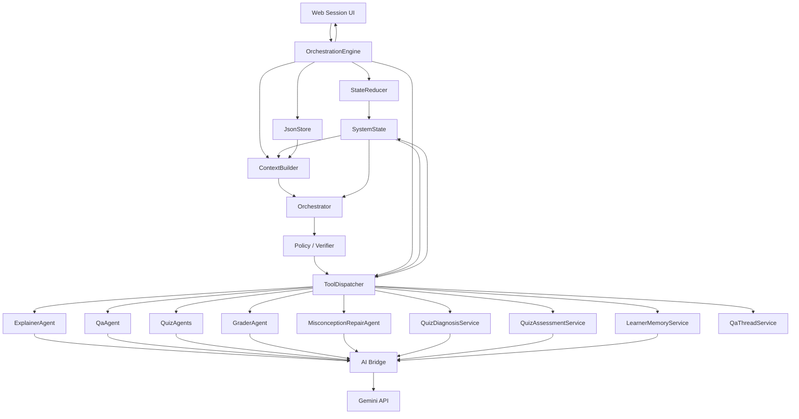

# 멀티 에이전트 시스템 설계 참고 초안

> 이 문서는 초기 멀티 에이전트 구상을 개발 참고용으로 보존한 원안입니다.
> 현재 확정 계약과 충돌할 경우 `docs/architecture.md`, `docs/api-spec.md`,
> `docs/ai-integration-contract.md`, 실제 OpenAPI 및 DB migration을 우선합니다.
> 특히 원문의 Gemini·JsonStore 중심 설명은 현재의 Grok(xAI)·Spring/MySQL 책임 경계로
> 그대로 구현하지 않습니다.

---

# 목차

- 원래 목차
    1. 전체 시스템 구조
        - 전체 아키텍쳐 개요
    2. 멀티 에이전트 동작 단계
        - 턴제 처리 구조의 큰 틀을 정의
    3. 현재 에이전트 구성 및 역할 정의
        - 각 에이전트별 명확한 역할의 정의
    4. 에이전트 프롬포트 및 처리 제약 정의
        - 각 에이전트가 역할별로 동작하기 위한 시스템 프롬포트 제약 정의
        - 각 에이전트별 입력 항목과 출력사항(JSON) 정의
    5. 각 모듈 역할 및 내부 처리 과정 정의
    6. 시스템 상태(State) 정의
        - 학습 세션의 상태를 정의하고 그에 따른 행동을 정의
    7. 에이전트 통신 프로토콜 정의
        - 각 서브 에이전트 호출 및 전체 에이전트 간의 통신 프로토콜 정의
        - 오류, fallback 처리 규칙 정의
    8. 에이전트 호출 원리 및 턴제 처리 구조 상세
        - 각 에이전트 출력대로, 통신 프로토콜을 활용하여 동작하는 알고리즘
    9. 정책 및 Tool Dispatcher 원리
        - 진단 규칙, 시스템 규칙을 정의한다
        - Tool Dispatcher의 동작을 명세한다
    10. 핵심 기능 시나리오
        - 해당 시스템에서 명확하게 동작해야하는 시나리오를 작성한다
    11. 시나리오 성공 기준
        - 10에서 소개한 시나리오의 성공의 기준을 명확히 정의한다
- 간략화 버전 목차
    1. 전체 시스템 구조
        - 전체 아키텍쳐 개요
    2. 멀티 에이전트 동작 단계
        - 턴제 처리 구조의 큰 틀을 정의
    3. 현재 에이전트 구성 및 역할 정의
        - 각 에이전트별 명확한 역할의 정의
    4. 핵심 기능 시나리오
        - 해당 시스템에서 명확하게 동작해야하는 시나리오를 작성한다
    5. 시나리오 성공 기준
        - 10에서 소개한 시나리오의 성공의 기준을 명확히 정의한다

# 1) 전체 시스템 구조

- 화살표는 100% 일치 X → 각 모듈 위주로만 볼 것



- Orchestration Engine
    - 전체 오케스트레이션 흐름을 구동하는 상위 실행 엔진
    - 사용자 요청과 시스템 상태를 기반으로 컨텍스트를 구성하고, 적절한 처리 모듈을 거쳐 에이전트·서비스·도구 호출을 조율하는 전체 실행 제어 시스템
- StateReducer
    - 사용자 이벤트가 들어오자 마자 오케스트레이터(LLM)의 판단 없이 세션 상태(State)를 업데이트하는 모듈
    - ex)
        - 현재 상태: 1페이지 학습중
        - 이벤트: 사용자가 텍스트 입력으로 “다음 페이지”입력
        - StateReducer 결과: `currentPage = 2`로 갱신
        - 실제 다음 페이지로 이동하기 위해서는 오케스트레이터가 다음 페이지로 이동시키는 Plan을 세우고, ToolDispatcher가 그걸 수행 해야함
- SystemState
    - 현재 학습 세션 안에서 → 현재 페이지, 대화기록, 퀴즈 기록, 학습자 수준 상태, 메모리 등등을 JSON 형태로 담고 있는 모듈
    - ex)
        - `학생id: String`
        - `currentPage: 3`
        - `대화기록: []`
- JsonStore
    - SystemState같은 데이터를 JSON 파일 형태로 서버에 저장하고, 필요할때 다시 불러오는 저장소 계층
    - 세션 불러오기
        - `JsonStore.getSession(sessionId)` → 현재 세션에 저장된 정보 불러옴
        - `JsonStore.saveSession(state)` → 변경된 state 값을 JSON으로 해당 id에 맞게 저장
- ContextBuilder
    - Orchestrator에 전달할 내용을 만드는 역할
    - 대략적으로
        - 최신 sessionState + PDF 현재 페이지 내용 + 이전/다음 페이지 내용 + 최근 대화 + 학습자 메모리 등등
    - ex)
        
        ```markdown
        현재 페이지: 3페이지
        현재 페이지 텍스트: 선형회귀 기울기 공식 설명
        이전 페이지: 평균과 편차 설명
        최근 질문: "편차가 뭔지 모르겠어"
        최근 퀴즈 결과: 기울기 해석 문제 오답
        학습자 메모리: 수식 전개를 어려워함
        ```
        
- Orchestrator (LLM)
    - Context Builder가 만들어준 내용 → 현재 사용자 이벤트와 세션 상태, PDF문맥, 과거 학습 이력을 보고 → 이번 턴에 어떤 에이전트/Tool을 실행할지, 무엇을 할지 결정하는 모듈
    - ex)
        - 출력이 다음과 같이 나온 경우
        
        ```python
        {
          "schemaVersion": "1.0",
          "pedagogyPolicy": {
            "mode": "EXPLAIN_FIRST",
            "reason": "현재 페이지가 새 페이지이므로 먼저 설명이 필요함",
            "allowDirectAnswer": true,
            "hintDepth": "MEDIUM",
            "interventionBudget": 3
          },
          "actions": [
            {
              "type": "CALL_TOOL",
              "tool": "EXPLAIN_PAGE",
              "args": {
                "page": 2,
                "detailLevel": "NORMAL"
              }
            },
            {
              "type": "CALL_TOOL",
              "tool": "PROMPT_BINARY_DECISION",
              "args": {
                "contentMarkdown": "퀴즈를 진행할까요?",
                "decisionType": "QUIZ_DECISION"
              }
            }
          ],
          "memoryWrite": null
        }
        ```
        
        - 현재 2페이지를 설명하고 + 설명이 끝나면 퀴즈 여부를 확인하라
- Policy / Verifier
    - 오케스트레이터가 만든 Tool 실행 계획이 현재 학습 상황과 교수 정책에 맞는지 검사하고 → 필요하다면 Action을 보정/제한한 뒤 → 최종 계획을 ToolDispatcher로 넘기는 계층
    - 추가적으로 오케스트레이터의 출력 JSON의 형식이 옳바른지도 확인
        - 미리 가능한 edge 케이스 / 오류 케이스를 방지하는 로직을 넣는 것
    - ex)
        - 현재 상황: 퀴즈 점수가 100점인 상태
        1. 오케스트레이터: 
            - 알수 없는 판단으로 오답 교정 에이전트를 호출하는 `Plan`
        2. Policy / Verifier:
            - 지금 점수 높다고 판단 → 이런 경우 오답 교정 상황이 아니라고 판단
            - 다음 학습 진행으로 계획 변경
        3. ToolDispatcher:
            - 세션값 업데이트하고 다음 페이지로 이동
- ToolDispatcher
    - 정책 검증이 완료된 Plan을 받아, 그 Action을 실제로 실행시키고, 그 결과를 SessionState와 UI 응답에 반영하는 모듈
    - 상황 예시
        - 오케스트레이터가 다음과 같은 plan을 생성한 경우
            
            ```python
            {
              "tool": "EXPLAIN_PAGE",
              "args": {
                "page": 2,
                "detailLevel": "NORMAL"
              }
            }
            ```
            
            - 2페이지 설명을 디테일 단계 중간으로 설정하여 설명하라
        - 이후 ToolDispatcher는 이를 보고
            - ExplanerAgent 호출
            - 이후 서브 에이전트의 출력물을 받아서 state 변경값과, ui에 맞게 가공
            - 이를 OrchestrationEngine이 받아서 JsonStore에 저장하고 → WebUI로 전달
- ExplainerAgent
    - 현재 PDF 페이지 내용을 학생 수준과 학습 이력에 맞게 설명하는 에이전트
    - ex)
        - 2페이지 내용을 일반 수준으로 설명해줘 → 페이지 핵심 개념을 풀어서 설명하게 됨
- QaAgent
    - 사용자의질문에 답변하는 질의응답 에이전트
    - 현재 페이지 내용, 이전 QA 흐름(메세지 Context제공), 학습자 메모리를 참고해서 답변
- QuizAgent
    - 학습 내용을 기반으로 퀴즈를 생성하는 에이전트 묶음
    - → Orchestrator의 계획에 따라 → 객관식/OX/단답형/서술형 퀴즈를 생성하게됨
        - 이때 학생수준, 약점, 현재 페이지/누적 학습 내용을 반영하여 문제를 만듦
- GraderAgent
    - 단답형/서술형 답안을 LLM으로 채점하여 → 채점 JSON으로 바꿔주는 모듈
    - 모든 채점을 GraderAgent가 진행 X
        - MCQ, OX: ToolDispatcher가 내부에서 정답 즉시 채점
        - 단답형(Short), 서술형(Essay): Gemini Bridge를 통해 LLM 채점
- MisconceptionRepairAgent
    - 퀴즈 점수가 기준 이하일 경우 주로 호출됨
    - 학생의 퀴즈 오답 원인을 찾고, 학생이 헷갈린 지점만 짧게 교정해주는 에이전트
    - `MisconceptionRepairAgent`: 진단 내용과 퀴즈 내용 + 강의 자료PDF를 통해 → 설명
- QuizDiagnosisService
    - 퀴즈 점수가 기준 미달인 경우 → 해당 퀴즈 결과를 보고 그에 대해서 어떤점이 헷갈리는지 어떤점이 부족한지 등을 추정해서 → 진단 프롬포트를 제시한다
    - ex)
        - 학생이 주로 틀린 문제: “분수 나눗셈관련 문제”
        - LLM이 사용하면:
            
            ```python
            focusConcepts: ["분수 나눗셈의 역수 개념", "나눗셈-곱셈 변환"]
            suspectedMisconceptions: [
              "절차는 기억하지만 역수를 곱해야 하는 이유를 설명하지 못함",
              "계산 규칙과 개념적 의미를 분리해서 이해하고 있음"
            ]
            diagnosticPrompt:
              "계산법은 기억나는 것 같은데, 왜 역수를 곱하는지가 헷갈린 것 같아요. '나누는 수를 역수로 바꾸는 이유'가 막혔나요, 아니면 계산 순서가 막혔나요?"
            ```
            
        - 이렇게 나오면 → 학생에게 질문할때 "계산법은 기억나는 것 같은데, 왜 역수를 곱하는지가 헷갈린 것 같아요. '나누는 수를 역수로 바꾸는 이유'가 막혔나요, 아니면 계산 순서가 막혔나요?"
        - 그러면 사용자가 그거에 대해서 답변
        - → 그 내용과 퀴즈 결과 + 강의 자료 바탕으로 해당 헷갈린 지점에 대한 개념을 보강해줌
- QuizAssessmentService
    - 퀴즈 결과를 다음 턴에 오케스트레이터가 참고할 메모로 바꿔주는 모듈
    - 퀴즈 결과를 입력을 받고 정해진 형식에 맞게 참고 메모 JSON으로 바꿔주는 모듈
    - ex)
        1. 퀴즈 결과와 강의 자료 내용을 입력
        2. LLM이 정해진 형식으로 JSON 결과값 출력
- LearnerMemoryService
    - 학생 개인화 메모리 관리자
    - 학생이 어떤 걸 잘하고, 어떤 걸 자주 헷갈리고, 어떤 방식의 설명/퀴즈가 학생에게 어울리는지를 메모리에 저장하고 → 다음 에이전트들이 참고할 수 있게 짧은 요약으로 바꿔주는 모듈
    - 메모리에 저장되는 주요한 내용
        
        ```python
        strengths              잘하는 개념
        weaknesses             약한 개념
        misconceptions          반복되는 오개념
        explanationPreferences  선호 설명 방식
        preferredQuizTypes      선호/효과적인 퀴즈 유형
        targetDifficulty        다음 난이도 방향
        nextCoachingGoals       다음 코칭 목표
        ```
        
- QaThreadService
    - 같은 페이지에서 이어지는 질문/답변 문맥을 잠깐 저장해주는 서비스

# 2) 멀티 에이전트 동작 단계

1. 이벤트 수신:
    - 텍스트 입력, 다음 페이지 이동, 퀴즈 제출, 퀴즈 형식 정의
2. StateReducer 동작:
    - 만약 이벤트 수신 이후 → LLM 판단없이 State Update가능한 부분은 업데이트
    - 단, State가 변경되었다고 해서 턴이 바뀌지는 않는다
3. Context Builder로 학습 컨텍스트 수집
4. Orchestrator Plan 생성:
    - 오케스트레이터에 의해서 Plan이 생성됨
5. Policy / Verifier로 Plan 검사:
    - 오케스트레이터가 출력한 Plan을 정책에 맞는지, 옳바른 형식인지 검사함
6. ToolDispatcher가 Plan에따른 SubAgent를 실행하게됨
7. SubAgent 실행 결과 반영
    - 각 서브에이전트들이 ToolDispatcher에 의해 실행됨
    - 각 결과를 ToolDispatcher가 받아 → StateUpdate (메시지, 퀴즈, 채점 결과 관련 state 업데이트)
        - 또한 결과를 UI형태로 코드화하여 → UI로 전달
8. RunTime State update
    - 서브 에이전트 실행 이후 필요한 현재 상태에 대한 update 수행
    - 설명이 끝난경우 → `page = EXPLAINED` 으로 변경 등등
9. OrchestrationEngine이 실행 결과 정리:
    - ToolDispatcher가 만든 새 메시지와 UI 변경사항을 모음
    - 사용자 메시지와 subAgent 메시지를 합친다
10. 세션 요약 / 평가 handoff 정리:
    - 현재 세션에서 나눴던 대화, 설명 내용등이 → 요약되어 `conversationSummary` 에 저장됨
        - 이때 퀴즈 내용은 여기다가 요약되어 저장되지 않음
        - 여기선, 대화창에 나왔던 모든 대화들이 (설명, 안내 메시지 포함) → 요약되어 정리됨
    - QuizResultLog에 퀴즈 결과 요약본이 저장됨:
        - 현재 세션 id, quiz id, 현재 페이지, 점수, 어떤 내용이 담겨있는지에 대한 요약
        - 단, 퀴즈 전체 내용은 7단계에서 ToolDispatcher에 의해 QuizRecord에 문제 원본과, 유저 답변, 결과등등이 저장됨
11. 최종 Session 저장
    - 이번턴에서 변경된 전체 `SessionState`를 `JsonStore` 모듈을 사용하여 저장함

# 3) 현재 LLM 에이전트 구성 및 역할 정의

- 입력값, 시스템 프롬포트에 있어야할 내용, 출력물 내용등을 정의
    - 실제 전체 내용이 아닌, 말로써 정의

### 3-1) Orchestrator 역할 정의

- 학습 세션에서 이번 턴에 무엇을 해야하는지 판단하는 중앙 계획자
- Context Builder가 만든 문맥을 보고 이번턴에 어떤 행동을할지 선택한다
- 입력값의 정의
    - 이벤트값:
        - 세션 입장 상태, 사용자 질문, 페이지 이동, 퀴즈 유형 선택, 퀴즈 제출 등의 사용자 이벤트가 들어옴
    - contextBuilder가 작성한 내용
        - 세션 상태, 최근 메시지, 퀴즈 기록 등등
- 시스템 프롬포트에 있어야 하는 내용
    - 역할 정의:
        - 에이전트 전체를 오케스트레이션하는 역할
        - 학생에게 직접적인 긴 설명 제공이 아니라, 정해진 형식에 맞는 Plan을 세워야 하는 역할
        - 실제 행동은 각각의 전문 에이전트가 수행하게 된다
    - 입력으로 고려해야할 정보:
        - 각 세션 State에 대한 대략적인 설명
        - 사용자 이벤트에 대한 대략적인 설명
    - 사고 흐름 정의:
        - 이번 턴의 목적을 우선적으로 정할 것
        - 바로 도구를 선탣하지 말고, 지금 당장 설명이 필요한 상황인지, 질문 응답인지, 퀴즈 인지 등등을 먼저 판단하도록 한다
        - 이후, 그 목적에 맞는 도구를 실행하거나, 행동을 할 계획을 출력한다
    - 도구 선택 원칙
        - 각 상황에선 어떤 subAgent를 호출하는가, 어떤 행동을 수행하는가를 정의해준다
        - ex)
            - 새 페이지이고, 설명이 필요하다고 판단되면 → 설명 에이전트를 호출한다
            - 퀴즈 결과 및 오개념 교정까지 끝나면 → LearnerMemoryService를 호출한다
            - 임시 메모리 내용이 반복적이고, 확실한 근거가 있다면 → MemoryWrite를 표기한다
    - 메모리 반영 원칙:
        - 학생 메모리값은 항상 갱신 X
        - 반복적인 약점, 명확한 오개념 등등 근거가 충분할 때만 반영한다
            - 단일 퀴즈 결과만 보고, 적은 데이터만 보고, 학생 수준을 과도하게 변경하지 않는다
- 출력값의 정의
    - ToolDispatcher가 보고 한번에 값을 추출할 수 있는 형태여야 한다
    - 주로 포함할 내용:
        - `turnGoal`: 이번 턴의 목적
        - `PedagoggyPolicy`:
            - 이번에 설명을 하거나 퀴즈를 만들때 어떤 난이도?, 예시 많이?, 설명 스타일, 디테일 정도를 출력하도록 함
        - `action`: 실제로 이번턴에 실행할 Tool OR 에이전트를 명시
        - `reason`: 이번 턴에는 왜 이런 계획을 세웠는지를 작성
            - 검증용, 디버깅용
        - `stop`: 무언가 오류 발생시 출력 → 사용자에게 오류 사실을 알리고, 다시 이벤트를 받도록 함

### 3-2) Explainer Agent 역할 정의

- 현재 PDF 페이지의 내용을 학생이 이해하기 쉽게 설명하는 전문 에이전트
- 주요 역할
    - 현재 페이지의 핵심 개념을 설명한다
    - 이때 학생 수준에 맞처 설명 난이도를 조절한다 (학생 수준은 입력으로 들어옴)
    - 학습자 메모리를 참고해 약점, 오개념, 선호 설명 방식을 반영
    - 필요하다면, 이전/다음 페이지 내용들을 모두 참고하여 → 설명 Context를 연결해야한다
    - 설명 이외의 텍스트 생성은 하지 않는다
- 주요 입력값
    - `fileRef`: Gemini filelib으로 업로드된 pdf
    - `page`: 페이지 번호
    - `detailLevel`: 설명 깊이
        - `Normal`: 보통 수준, 핵심 개념 위주 설명
        - `DETAILED`: 매우 자세한 설명, 예시
    - `LearnerLevel`: 학생의 현재 수준 Comment
    - `LearnerMemoryDigest`: 현재 학생의 누적 학습 메모리 요약
        - 약점, 강점, 오개념, 선호 설명 방식 등이 포함될 수 있음
- 시스템 프롬포트에 있어야 하는 내용
    
    ```mermaid
    너는 교육형 LMS의 ExplainerAgent이다.
    
    너의 역할은 현재 PDF 페이지 내용을 학생이 이해하기 쉽게 설명하는 것이다.
    반드시 현재 페이지를 중심으로 설명하고, 이전/다음 페이지는 맥락 보조용으로만 사용하라.
    
    학생 수준과 학습자 메모리를 반영해 설명 난이도와 예시 방식을 조절하라.
    학생의 약점이나 오개념이 보이면 더 쉬운 예시와 단계적 설명을 제공하라.
    이미 잘 알고 있는 내용은 지나치게 반복하지 말고 핵심만 연결하라.
    
    설명은 Markdown 형식으로 작성하라.
    퀴즈 생성, 채점, 자유 질문 답변, 오답 교정은 수행하지 말고 페이지 설명에 집중하라.
    ```
    
- 출력값의 정의
    - markdown: 학생에게 실제로 보여줄 페이지 설명
    - thoughtSummary: 설명을 생성할 때 내부 판단 요약

### 3-3) QA Agent 역할 정의

- 학생이 입력한 질문에 대해, 현재 학습중인 PDF 페이지 문맥을 기준으로 답변을 생성하는 전문 에이전트
    - QA Agent는 현재 페이지 텍스트, 학생 질문, 학습자 수준, 학습자 메모리, 이전 QA 문맥을 참고하여 학생에게 보여줄 답변을 만든다
- 주요 역할
    - 학생의 자유 질문에 답변한다
    - 현재 페이지 내용을 중심으로 답변한다
    - 또한 학생 수준과 학습자 메모리를 반영하여 설명 난이도를 조절한다
    - 만약 이전 QA가 있다면 = 후속 질문이면 → 이전 QA 문맥을 참고하여 답변한다
    - 답변은 Markdown 형식으로 출력한다
- 주된 입력값
    - `fileRef`: Gemini filelib으로 업로드된 pdf
    - `page`: 페이지 번호
    - `LearnerLevel`: 학생의 현재 수준 Comment
    - `LearnerMemoryDigest`: 현재 학생의 누적 학습 메모리 요약
        - 약점, 강점, 오개념, 선호 설명 방식 등이 포함될 수 있음
    - `qaThreadDigest` : 같은 컨텍스트 내에서 이어진 이전 질문/답변 요약
        - 후속 질문이라고 판단될때만 → 해당 내용을 참고함
    - `qaThreadMode`:
        - `“START_NEW”`: 이번에 입력된 사용자 입력은 새로운 질문이다
        - `“FOLLOW_UP”`: 이번 질문은 후속 질문이다
            - `“FOLLOW_UP”`일때는 이전 QA문맥을 참고해야한다는 신호
- 시스템 프롬포트 대략 내용
    - 너는 교육형 LMS의 **QA Agent**이다.
    - 학생의 질문에 대해 **현재 PDF 페이지 문맥을 기준으로** 답변한다.
    - 답변은 학생이 이해하기 쉽게 작성한다.
    - **현재 페이지 내용을 우선 근거**로 사용한다.
    - 제공된 정보만으로 답하기 어려우면 추측하지 않고 한계를 설명한다.
    - 학생 수준과 학습자 메모리를 반영해 설명 난이도와 예시 방식을 조절한다.
    - `qaThreadMode`가 `START_NEW`이면 새로운 질문 흐름으로 보고 답변한다.
    - `qaThreadMode`가 `START_NEW`이면 `qaThread` 내용이 있더라도 참고하지 않는다.
    - `qaThreadMode`가 `FOLLOW_UP`이면 같은 질문 흐름의 후속 질문으로 본다.
    - `qaThreadMode`가 `FOLLOW_UP`이면 반드시 `qaThread`에 있는 이전 QA 문맥을 참고해 자연스럽게 이어서 답변한다.
    - 답변은 **Markdown 형식**으로 작성한다.
    - 필요한 경우 수식은 **LaTeX 형식**으로 표현한다.
    - 퀴즈 생성, 채점, 전체 페이지 설명, 오답 교정은 수행하지 않는다.
    - 역할 범위는 **학생 질문에 대한 답변 생성**에 집중한다.
- 출력값 정의
    
    ```json
    {
      markdown: string;
      thoughtSummary: string;
    }
    ```
    
    - `markdown`: 학생에게 실제로 보여줄 QA 답변 본문
    - `thoughtSummary`: 답변 생성 과정의 내부 판단 요약

### 3-4) Quiz Agent 역할 정의

- 현재 학습 범위와 학생 상태를 바탕으로 퀴즈를 생성하는 전문 에이전트
- 오케스트레이터가 → 각 시험 형식과 함께 다음중 하나를 계획하면:
    - `GENERATE_QUIZ_MCQ`, `GENERATE_QUIZ_OX`, `GENERATE_QUIZ_SHORT`, `GENERATE_QUIZ_ESSAY`  → ToolDispatcher가 수행됨
- 주요 역할
    - 선택된 퀴즈 유형에 맞는 문항을 생성한다:
        - `MCQ`: 객관식
        - `OX`: OX문제
        - `SHORT`: 단답형
        - `ESSAY`: 서술형
    - 현재 페이지 또는 누적 학습 범위 내용을 기반으로 문제를 만든다
    - 학습자 수준과 목표 난이도에 맞춰 문항 난이도를 조절한다
    - 문항수 자체는 → 기본값 5문항
        - 학생 수준/자신감/약점/오개념/페이지 복잡도 등에 따라 5~10 범위에서 알아서 조정
- 주요 입력값
    - `fileRef`: Gemini가 참고할 PDF파일
    - `page`: 퀴즈를 생성할 기준 페이지 → 현재 페이지
    - `quizType`: 생성할 퀴즈 타입 요청 → MCQ, OX, SHORT, ESSAY
    - `coverageStartPage`: 퀴즈 범위 시작 페이지
    - `coverageEndPage`: 퀴즈 범위 끝 페이지
    - `learnerLevel`: 학생 수준
    - `learnerConfidence`: 학생 자신감 수치
        - 학생이 새로운 개념을 얼마나 잘 이해할 수 있는가?
            - $\approx0$: 새로운 개념을 받아들이는 데 부담이 있을 수 있음
                - 문항수 증가 + 좀더 개념적인 (기초적인) 질문으로 생성
            - $\approx 1$: 새로운 개념을 받아들일 준비가 되어 있음
                - 기초적인 질문보다, 심화적인 문제를 만들어냄
    - `learnerMemoryDigest`: 학생의 누적 학습 메모리 요약본
        - 약점, 오개념, 선호 유형등을 반영할 수 있음
    - `qaThreadDigest`: 퀴즈 답변 문맥 → 다만 퀴즈 범위와 벗어난다면 → 반영 X
        - 이 부분은 시스템적으로 별도로 처리해주는 로직이 필요함
    - `sessionId`, `lectureId` : 주로 로그/추적용
- 시스템 프롬포트 대략 내용
    - 너는 교육형 LMS의 **QuizAgent**이다.
    - 역할은 주어진 PDF 학습 범위와 학생 상태를 바탕으로 **퀴즈 JSON을 생성**하는 것이다.
    - 반드시 제공된 페이지 내용을 근거로 문제를 만든다.
    - 채점이나 오답 교정은 수행하지 않고, 퀴즈 생성에만 집중한다.
    - 설명 문장이나 부가 텍스트 없이 정해진 **JSON 형식**만 출력한다.
    - **[입력값을 설명하는 부분]**
        - 퀴즈 생성에 필요한 PDF 정보, 페이지 범위, 퀴즈 유형, 학생 수준, 학습자 메모리, QA 문맥 등을 설명한다.
    - **[퀴즈 유형별 필수 필드를 설명하는 부분]**
        - `MCQ`, `OX`, `SHORT`, `ESSAY`별로 반드시 포함해야 하는 필드를 설명한다.
    - **[학생 상태를 반영하는 방식]**
        - 학생 수준, 학습자 메모리, 약점, 오개념, QA 문맥을 반영해 문항을 구성한다.
        - 이미 잘하는 내용만 반복 출제하지 않는다.
    - **[learnerConfidence 반영 방식]**
        - `learnerConfidence`는 학생이 새로운 개념을 받아들일 준비 정도로 해석한다.
        - 낮으면 기초적·개념적 문항 비중과 점검 문항 수를 늘린다.
        - 높으면 불필요한 반복을 줄이고 응용·심화 문항을 포함할 수 있다.
    - **[문항 수 조절 방식]**
        - 문항 수는 5~10개 범위에서 조절한다.
        - 학습 범위, 페이지 복잡도, 약점, 오개념, QA 문맥, `learnerConfidence`를 함께 고려한다.
        - 최종 문항 수와 `questions` 배열 길이가 일치해야 한다.
    - **[출력 JSON 형식을 설명하는 부분]**
        - 전체 퀴즈 JSON 구조와 문항별 공통 필드, 유형별 필수 필드를 설명한다.
- 출력값 정의
    - 생성된 Quiz에 대한 JSON:
        - `schemaVersion:` 현재 스키마 구조 버전 정의
        - `quizId`: 현재 세션에서 퀴즈 id
        - `quizType`:
            - `MCQ`, `OX`, `SHORT`, `ESSAY` 등의 타입이 결정됨
        - `page`: 퀴즈가 생성되었을때 기준 페이지
        - `title`: 퀴즈 제목
        - `question`: 문항 목록
    - 문항별 주요 필드:
        - 각 문항 별로 → 문제/채점 기준/정답 등의 필드를 포함해야함
            - 각 QuizType에 따라 달라지도록 설계해야함

### 3-5) Grader Agent 역할 정의

- 학생이 제출한 단답형 또는 서술형 답안을 기준으로 답안과 채점 루브릭에 따라 평가하는 전문 에이전트
- 주요 역할
    - 단답형 / 서술형 답안을 채점
    - 문제 JSON에 포함된 기준 답안, 모범 답안, 루브릭을 참고하여 → 사용자 답변에 대해서 채점을 수행하게 된다
    - 각 문항별로, 사용자 답변에 대한 피드백을 작성한다
    - 채점 결과는 반드시 정해진 JSON 구조로 반환하게 된다
    - 객관식/OX 자동 채점은 담당하지 않는다
- 주요 입력값
    - `fileRef`: Gemini가 참고할 PDF파일
    - `page`: 채점 대상 퀴즈가 생성된 페이지
    - `quiz`: 채점할 quiz JSON
        - 안에 문제/기준 답안/루브릭/배점 정보가 포함됨
    - `answer`: 학생이 제출한 답안 JSON
    - `learnerMemoryDigest`: 학생의 누적 학습 메모리 요약본
- 시스템 프롬포트에 들어가면 좋은 내용
    - 너는 교육형 LMS의 **GraderAgent**이다.
    - 역할은 학생이 제출한 **단답형/서술형 답안**을 문제 JSON과 루브릭에 따라 채점하는 것이다.
    - 점수는 반드시 **엄격하고 일관되게** 부여한다.
    - 각 문항에 대해 **점수, 최대 점수, 정오답 판정, 피드백**을 작성한다.
    - 판정은 반드시 `CORRECT`, `WRONG`, `PARTIAL` 중 하나만 사용한다.
    - 설명 문장, 코드블록, 불필요한 텍스트 없이 정해진 **채점 JSON 형식**만 출력한다.
    - **[입력값을 설명하는 부분]**
        - 채점에 필요한 문제 JSON, 학생 답안, 루브릭, 최대 점수 정보를 설명한다.
        - 문제 JSON에는 문항 ID, 문제 내용, 정답 기준, 루브릭, 배점 등이 포함될 수 있다.
        - 학생 답안에는 각 문항에 대한 학생의 제출 답변이 포함된다.
        - 학생 통합 메모리가 제공되면 이전 학습 이력, 약점, 오개념, 보충 필요 개념을 참고할 수 있다.
        - 단, 학생 통합 메모리는 피드백 보완에만 활용하고, 근거 없이 학생의 능력이나 성향을 과잉 추론하지 않는다.
    - **[채점 기준을 설명하는 부분]**
        - 반드시 문제 JSON의 정답 기준과 루브릭을 바탕으로 채점한다.
        - 루브릭이 제공된 경우 루브릭을 우선 적용한다.
        - 루브릭이 없는 경우 정답의 핵심 요소 포함 여부를 기준으로 판단한다.
        - 표현이 다르더라도 핵심 의미가 정확하면 정답으로 인정할 수 있다.
        - 핵심 개념이 일부만 맞거나 설명이 불완전하면 부분점수를 부여한다.
        - 핵심 개념이 틀렸거나 문제 요구와 맞지 않으면 오답 처리한다.
    - **[문항별 판정 방식]**
        - `CORRECT`는 정답의 핵심 요소를 충분히 포함하고 루브릭 기준을 대부분 충족한 경우 사용한다.
        - `PARTIAL`은 일부 핵심 요소는 맞지만 누락, 오류, 설명 부족이 있는 경우 사용한다.
        - `WRONG`은 핵심 내용이 틀렸거나, 답변이 비어 있거나, 문제와 무관한 경우 사용한다.
        - 점수는 반드시 `0` 이상 `maxScore` 이하로 부여한다.
        - `CORRECT`는 일반적으로 만점 또는 만점에 가까운 점수를 부여한다.
        - `PARTIAL`은 루브릭 충족 정도에 따라 부분점수를 부여한다.
        - `WRONG`은 일반적으로 `0`점을 부여한다.
    - **[피드백 작성 방식]**
        - 피드백은 학생 답안에서 맞은 부분과 부족한 부분을 구체적으로 짚어 작성한다.
        - 정답을 단순히 알려주는 것에 그치지 않고, 부족한 개념을 짧게 보충한다.
        - 단답형은 간결하게 피드백한다.
        - 서술형은 논리 구조, 핵심 개념 누락, 설명의 정확성을 중심으로 피드백한다.
        - 학생 통합 메모리가 제공되면 학생의 기존 약점이나 오개념과 연결해 보충 포인트를 반영한다.
        - 피드백은 과도하게 길지 않게 작성한다.
    - **[출력 JSON 형식을 설명하는 부분]**
        - 출력은 반드시 정해진 채점 JSON 형식만 반환한다.
        - 문항별 채점 결과와 전체 점수 합산 정보를 포함한다.
        - 각 문항 결과에는 문항 ID, 점수, 최대 점수, 판정, 피드백을 담는다.
        - 판정 값은 반드시 `CORRECT`, `WRONG`, `PARTIAL` 중 하나만 사용한다.
    - **[출력 JSON 예시 구조]**
        - 최상위에는 전체 채점 결과와 총점을 담는다.
        - 각 문항 결과에는 문항 ID, 점수, 판정, 피드백을 담는다.
- 출력값 정의
    - GradingResult JSON 값을 출력한다:
        - 현재 퀴즈 ID
        - type
        - total Score
        - maxScore
        - items: 문항별 채점 결과 목록 + 각 문항별 피드백 결과

### 3-6) MisConceptionRepair Agent 역할 정의

- 퀴즈 이후 학생이 틀린 개념이나 헷갈린 지점을 짧게 교정하는 전문 에이전트
- 학생이 퀴즈에서 기존 점수보다 낮은 결과물을 받으면 → 시스템은 어디가 헷갈렸는지 질문을 던진다
- 학생이 질문에 답을 하면 → 그 헷갈린 지점과 퀴즈 결과를 바탕으로 → 설명문을 제시하게된다
- 주요 역할
    - 학생의 오답 원인을 바탕으로 헷갈린 개념만 짧게 교정한다
    - 전체 페이지를 처음부터 다시 설명하지 않는다
    - 퀴즈에서 틀린 문항, 집중 개념, 의심 오개념, 학생의 진단 답변을 반영한다
- 주요 입력값
    - `fileRef`: Gemini가 참고할 PDF 파일
    - `page`: 오답 교정과 관련된 페이지
    - `learnerLevel`: 학생 수준
    - `learnerMemoryDigest`: 학생의 누적 학습 메모리 요약
    - `repairQuestion`: 학생이 어려워하고 있는 정보, 헷갈려 하고 있는 정보, 오개념을 가지고 있는 정보 등을 바탕으로 → MisconceptionRepair에 넣을 입력 프롬포트 작성
- 출력값 정의
    - markdown: 오답 교정에 대한 설명

### 3-7) QuizDiagnosisService Agent 역할 정의

- 퀴즈가 점수 미달인 경우, 퀴즈 결과를 보고, 학생이 어떤 개념을 헷갈렸는지 추정하는 진단 서비스
- 오답 결과를 바로 복습으로 넘기지 않고, 먼저 학생에게 어디가 막혔는지 확인하는 진단 질문을 먼저 수행
- 이후 학생의 답변과 퀴즈결과를 바탕으로 `MisconceptionRepairAgent` 가 보강하게 된다
- 주요 역할
    - 기준 점수 미달 퀴즈 결과를 분석한다
    - 학생이 헷갈렸을 가능성이 높은 개념과 오개념을 추정한다
    - 학생에게 보여줄 진단 프롬포트를 생성
- 주요 입력값
    - quizResult: 퀴즈 점수, 점수 비율, 통과 여부 등이 들어감
    - wrongItems: 틀린 문항, 학생 답안, 정답/모범 답안, 채점 피드백
    - lectureContext: 퀴즈가 출제된 페이지 또는 관련 강의자료 내용
    - learnerMemoryDigest: 학생의 메모리 요약본
- 시스템 프롬포트에 들어가면 좋을 내용
    - 너는 교육형 LMS의 `QuizDiagnosisService`이다
    - 역할은 기준 미달 퀴즈 결과를 보고 학생이 헷갈린 지점을 추정하는 것이다
    - 학생에게 바로 정답이나 전체 해설을 제공하지 않는다
    - 먼저 학생이 막힌 부분을 확인할 수 있는 짧은 진단 질문을 만든다
    - 퀴즈 오답, 학생 답안, 강의 자료 문맥을 근거로 판단한다
    - 단일 오답만으로 학생 수준을 과도하게 단정하지 않는다
    - 출력은 정해진 진단 JSON 형식으로 작성한다
- 출력값 정의
    - `focusConcepts`
        - 학생이 헷갈렸을 가능성이 높은 핵심 개념 목록
    - `suspectedMisconceptions`
        - 오답 결과를 바탕으로 추정한 오개념 목록
    - `diagnosticPrompt`
        - 학생에게 실제로 보여줄 진단 질문
    - `evidence`
        - 어떤 오답을 근거로 이런 진단을 했는지에 대한 간단한 요약
    - `repairHint`
        - 이후 오답 교정 에이전트가 참고할 보강 방향
    - 예시
        
        ```json
        focusConcepts: ["분수 나눗셈의 역수 개념", "나눗셈-곱셈 변환"]
        suspectedMisconceptions: [
          "절차는 기억하지만 역수를 곱해야 하는 이유를 설명하지 못함",
          "계산 규칙과 개념적 의미를 분리해서 이해하고 있음"
        ]
        diagnosticPrompt:
          "계산법은 기억나는 것 같은데, 왜 역수를 곱하는지가 헷갈린 것 같아요. '나누는 수를 역수로 바꾸는 이유'가 막혔나요, 아니면 계산 순서가 막혔나요?"
        ```
        

### 3-8) QuizAssesementService Agent 역할 정의

- 퀴즈 결과를 다음 턴에 오케스트레이터가 참고할 수 있는 평가 메모로 바꿔주는 서비스
- 퀴즈 결과와 강의 자료를 입력받고, 정해진 형식의 참고 메모 JSON을 생성한다
- 주요 내용
    - 채점이 끝난 후 퀴즈 결과를 분석한다
    - 점수, 오답 문항, 학생 답안, 강의 자료 내용을 함께 참고한다
    - 학생이 현재 내용을 어느 정도 이해했는지, 어떤 부분을 보강해야 하는지 정리한다
    - 결과는 다음 턴 오케스트레이터가 참고할 수 있는 JSON 형태로 출력한다
- 주요 역할
    - 퀴즈 점수와 문항별 결과를 바탕으로 학생의 이해 상태를 요약한다
    - 맞힌 문항을 통해 강점 개념을 추정한다
    - 틀린 문항을 통해 약점 개념과 보강 필요 지점을 추정한다
    - 강의 자료 기준으로 어떤 개념을 다시 설명해야 할지 정리한다
    - 다음 턴에서 설명, 복습, 재퀴즈, 다음 페이지 진행 중 어떤 방향이 적절한지 참고 힌트를 제공한다
    - 학습자 메모리에 저장할 만한 후보 정보가 있다면 함께 정리한다
- 주요 입력값
    - `quizResult`
        - 퀴즈 ID, 퀴즈 타입, 총점, 점수 비율, 문항별 채점 결과
    - `studentAnswers`
        - 학생이 제출한 문항별 답안
    - `quizItems`
        - 문항 내용, 정답, 모범 답안, 채점 기준
    - `fileRef`: Gemini가 참고할 PDF 파일
    - `page`: 퀴즈와 관련된 페이지
    - `learnerMemoryDigest`
        - 기존 학습자 약점, 오개념, 설명 선호, 이전 학습 이력 요약
- 시스템 프롬포트에 들어가면 좋을 내용
    - 너는 교육형 LMS의 `QuizAssessmentService`이다
    - 역할은 퀴즈 결과를 분석해 다음 턴 오케스트레이터가 참고할 평가 메모를 만드는 것이다
    - 학생에게 직접 말하는 긴 피드백을 작성하지 않는다
    - 퀴즈 결과와 강의 자료를 근거로 이해 상태, 강점, 약점, 보강 필요 개념을 정리한다
    - 단일 퀴즈 결과만으로 학생 수준을 과도하게 단정하지 않는다
    - 출력은 정해진 평가 JSON 형식으로 작성한다
- 주된 출력값
    - `understandingSummary`
        - 이번 퀴즈를 통해 본 학생의 전체 이해 상태 요약
    - `strengths`
        - 비교적 잘 이해한 개념 목록
    - `weaknesses`
        - 보강이 필요한 개념 목록
    - `suspectedMisconceptions`
        - 오답에서 드러난 오개념 후보
    - `memoryCandidates`
        - 학습자 메모리에 저장할 만한 강점, 약점, 오개념 후보
    - `evidence`
        - 어떤 문항과 답안을 근거로 판단했는지에 대한 간단한 요약

### 3-9) LearnerMemoryService 역할 정의

- 학생 개인화 메모리를 관리하는 서비스
- 학생이 어떤 개념을 잘하고, 어떤 개념을 자주 헷갈리는지, 어떤 설명 방식이나 퀴즈 유형이 잘 맞는지를 저장한다
- 저장된 메모리는 다음 턴에서 Orchestrator와 각 에이전트가 참고할 수 있도록 짧은 요약 형태로 제공된다
    - 이때 핵심은 오케스트레이터가 memoryWrite를 해야 → 정식 메모리에 업데이트 된다
    - 그 전까지, LearnerMemoryService가 만든 항목은 임시 메모리에 저장된다
- 내용
    - 학습 과정에서 발생한 퀴즈 결과, 오답 교정 결과, 질문/답변 흐름 등을 바탕으로 임시 학생 메모리를 갱신한다
    - 이후 설명, QA, 퀴즈 생성, 오답 교정에서 학생 맞춤형 응답을 만들기 위한 개인화 정보로 사용된다 → 차후에 정식 메모리로 업데이트 된다면 가능한 사항 (정식 메모리가 되는 조건 = 오케스트레이터가 MemoryWrite를 해준 경우)
- 주요 역할
    - 학생의 강점 개념을 `strengths`에 저장한다
    - 학생이 어려워하는 개념을 `weaknesses`에 저장한다
    - 반복적으로 드러나는 오개념을 `misconceptions`에 저장한다
    - 학생에게 잘 맞는 설명 방식을 `explanationPreferences`에 저장한다
    - 학생에게 효과적인 퀴즈 유형을 `preferredQuizTypes`에 저장한다
    - 다음 퀴즈나 설명의 난이도 방향을 `targetDifficulty`로 관리한다
    - 다음 턴에서 집중해야 할 코칭 목표를 `nextCoachingGoals`에 저장한다
    - 저장된 메모리를 다른 에이전트가 참고하기 쉬운 짧은 요약으로 변환한다
- 주요 입력값
    - `quizAssessment`
        - 퀴즈 결과를 바탕으로 정리된 강점, 약점, 오개념 후보
    - `diagnosisResult`
        - 오답 진단 과정에서 추정된 헷갈린 개념과 오개념
    - `repairResult`
        - 오답 교정 이후 새롭게 확인된 보강 필요 개념
    - `qaHistory`
        - 학생이 자주 질문한 내용이나 반복적으로 어려워한 부분
    - `currentMemory`
        - 기존에 저장되어 있던 학생 개인화 메모리
- 시스템 프롬포트에 들어가면 좋을 내용
    - 너는 교육형 LMS의 `LearnerMemoryService`이다
    - 역할은 학생의 장기적인 개인화 메모리를 관리하는 것이다
    - 학생의 강점, 약점, 오개념, 선호 설명 방식, 효과적인 퀴즈 유형을 정리한다
    - 메모리는 다음 에이전트들이 바로 참고할 수 있도록 짧고 구체적으로 작성한다
    - 출력은 정해진 메모리 JSON 형식으로 작성한다
- 출력값 정의
    - `strengths`
        - 학생이 잘 이해하거나 안정적으로 맞히는 개념
    - `weaknesses`
        - 학생이 자주 틀리거나 추가 설명이 필요한 개념
    - `misconceptions`
        - 반복적으로 나타나는 오개념 또는 잘못된 이해 방식
    - `explanationPreferences`
        - 학생에게 잘 맞는 설명 방식
        - ex) 쉬운 예시 중심, 단계별 풀이, 시각적 비유, 짧은 요약
    - `targetDifficulty`
        - 다음 설명이나 퀴즈에서 적용할 난이도 방향
        - ex) `FOUNDATIONAL`, `BALANCED`, `CHALLENGING`
    - `nextCoachingGoals`
        - 다음 학습 턴에서 우선적으로 도와야 할 목표
    - `memoryDigest`
        - Orchestrator와 각 서브 에이전트가 참고할 수 있는 짧은 메모리 요약

# 4) 핵심 기능 시나리오

- 실시간 스트리밍
    - 사고과정 ThoughtSummary와 답변 chunk를 실시간으로 받아 → 실시간으로 ToolDispatcher로 전달한 후 → 실시간으로 해당 chunk가 UI로 뜨도록 할 것
    - 실시간 스트리밍과 사고 과정 요약은 Google Gemini API 가이드를 읽어볼 것

### 1) 일반 강의 흐름: **페이지 1 → 페이지 2**

1. 사용자가 학습 세션에 처음 입장한다.
2. 오케스트레이터는 현재 위치가 `페이지 1`임을 확인하고, 우선 이 페이지를 설명해야 한다고 판단한다.
3. 오케스트레이터는 사용자에게 `강의를 시작할까요?` 선택 UI를 표시하도록 계획한다.
4. ToolDispatcher는 오케스트레이터의 계획에 따라 `예 / 아니오` 선택 UI를 채팅 화면에 전달한다.
5. 사용자가 `아니오`를 누르면, 시스템은 추가 설명을 시작하지 않고 다음 사용자 이벤트를 기다린다.
6. 사용자가 `예`를 누르면, 오케스트레이터는 `페이지 1 설명`이 필요하다고 판단하고 `Explainer` 호출 계획을 만든다.
7. ToolDispatcher는 오케스트레이터의 계획을 받아 `Explainer`를 호출한다.
8. Explainer는 PDF와 현재 페이지 문맥을 바탕으로 페이지 설명문을 생성한다.
9. 생성된 설명문은 ToolDispatcher로 전달된다.
10. ToolDispatcher는 설명문을 세션 메시지로 반영하고, 프론트엔드에 전달한다.
11. 사용자 입장에서는 설명문이 채팅 화면에 출력된다.
12. 설명이 끝나면 오케스트레이터는 사용자에게 `다음 페이지로 이동할까요?` 선택 UI를 표시하도록 계획한다.
13. ToolDispatcher는 `다음 페이지 이동` 선택 UI를 채팅 화면에 전달한다.
14. 사용자가 `아니오`를 누르면, 현재 페이지에 머무른 채 다음 사용자 이벤트를 기다린다.
15. 사용자가 `예`를 누르면, 오케스트레이터는 `페이지 2로 이동` 액션을 계획한다.
16. ToolDispatcher는 세션의 현재 페이지를 `페이지 2`로 갱신한다.
17. 프론트엔드는 최종 응답을 받아 PDF 뷰어와 세션 상태를 `페이지 2` 기준으로 동기화한다.
18. 이후 같은 흐름으로 `페이지 2 설명 시작 여부`를 다시 판단한다.

### 2) 사용자가 임의로 질문을 하는 경우

1. 특정 페이지에 대한 설명이 UI에 표시된다.
2. 사용자가 해당 설명에 대해 궁금한 점을 텍스트 필드에 입력하고 전송한다.
3. 질문 이벤트가 발생하면 `Orchestrator`는 이를 현재 페이지 설명에 대한 질문으로 판단하고, `QaAgent`를 호출하는 Plan을 세운다.
4. `ToolDispatcher`는 Plan에 따라 `QaAgent`를 호출한다.
    - 만약 이번 페이지, 이번 설명 문맥에서 처음 수행하는 QA라면 기존 `QAThread`를 비우거나 새로 시작한다.
5. `QaAgent`는 현재 페이지 내용, 사용자 질문, 학습자 메모리, `QAThread`를 참고해 답변을 작성한다.
6. `ToolDispatcher`는 `QaAgent`의 답변을 받아 UI에 전달한다.
7. 이때 사용자의 질문과 `QaAgent`의 답변은 `QAThread`에 저장된다.
8. 이후 사용자가 같은 페이지나 같은 설명 문맥에서 다시 질문하면, `Orchestrator`는 이를 추가 질문으로 판단하고 다시 `QaAgent` 호출 Plan을 세운다.
9. `ToolDispatcher`는 기존 `QAThread`를 함께 참고하도록 하여 `QaAgent`를 재호출하고, 이어지는 질문에도 이전 문맥이 반영된 답변이 나오도록 한다.

### 3) 사용자가 질문을 하는데 메모리 저장하고 싶은 경우

1. 사용자가 특정 페이지 설명을 읽고 질문을 입력한다.
2. `Orchestrator`는 해당 질문이 현재 페이지 설명에 대한 질문이라고 판단하고, `QaAgent` 호출 Plan을 세운다.
3. `ToolDispatcher`는 Plan에 따라 `QaAgent`를 호출한다.
4. `QaAgent`는 현재 페이지 내용, 사용자 질문, 학습자 메모리, `QAThread`를 참고해 답변을 생성한다.
5. `ToolDispatcher`는 생성된 답변을 UI에 전달하고, 사용자의 질문과 답변을 `QAThread`에 저장한다.
6. 이때 사용자의 질문이 단순 질문을 넘어서, 적극적인 학습 태도나 의미 있는 학습 패턴을 보여준다고 판단될 수 있다.
    - 예를 들어 사용자가 스스로 헷갈린 지점을 구체적으로 설명하거나, 이전 설명과 연결해 질문하거나, 자신의 이해를 점검하는 방식으로 질문한 경우가 이에 해당한다.
7. `Orchestrator`는 해당 질문/답변 흐름이 이후 학습자 이해 상태를 판단하는 데 참고할 만하다고 판단하면, `LearnerMemoryService` 호출 Plan을 추가로 세울 수 있다.
8. `ToolDispatcher`는 Plan에 따라 `LearnerMemoryService`를 호출한다.
9. `LearnerMemoryService`는 해당 질문 흐름을 바탕으로 학습자의 관심사, 적극성, 헷갈리는 개념, 선호하는 설명 방식 등을 임시 메모리 후보로 정리한다.
10. 이 과정에서 UI에는 필요하다면 “학습자 메모리 업데이트 중”과 같은 짧은 상태 문구가 표시될 수 있다.
11. 단, 이 정보는 곧바로 실제 장기 학습자 메모리로 확정 저장되지는 않는다.
12. 이후 비슷한 질문 패턴이나 학습 태도가 반복적으로 확인되면, `Orchestrator`가 별도의 `MemoryWrite`를 통해 실제 학습자 메모리 반영을 결정할 수 있다.

### 3) 설명 이후 퀴즈가 나오고, 퀴즈 제출하기까지의 흐름

1. 오케스트레이터는 전체 PDF의 학습 흐름 속에서 현재 페이지가 중요한 개념이나 핵심 내용을 담고 있다고 판단하면, 해당 페이지 설명 이후 학습 확인을 위한 퀴즈가 필요하다고 결정한다.
2. 오케스트레이터는 이를 바탕으로 `페이지 설명`과 `설명 이후 퀴즈 진행`을 포함한 plan을 생성한다.
3. ToolDispatcher는 오케스트레이터의 plan을 전달받는다.
4. ToolDispatcher는 plan에 따라 먼저 `Explainer Agent`를 호출한다.
5. Explainer Agent는 현재 페이지의 PDF 문맥을 바탕으로 설명문을 생성한다.
6. 생성된 설명문은 ToolDispatcher로 전달된다.
7. ToolDispatcher는 설명문을 시스템 UI에 전달한다.
8. 사용자 입장에서는 현재 페이지 설명이 채팅 화면에 출력된다.
9. 설명이 끝나면 ToolDispatcher는 퀴즈 유형을 선택할 수 있는 UI를 표시한다.
10. 퀴즈 유형 선택 UI에는 `객관식(MCQ)`, `OX`, `단답형`, `서술형` 옵션이 제공된다.
11. 사용자가 원하는 퀴즈 유형을 선택한다.
12. 사용자의 선택으로 `QUIZ_TYPE_SELECTED` 이벤트가 발생한다.
13. 오케스트레이터는 해당 이벤트를 보고, 사용자가 선택한 퀴즈 유형에 맞는 퀴즈 생성이 필요하다고 판단한다.
14. 오케스트레이터는 선택된 퀴즈 유형을 기준으로 `QuizAgent` 호출 plan을 생성한다.
15. ToolDispatcher는 오케스트레이터의 plan에 따라 `QuizAgent`를 호출한다.
16. QuizAgent는 현재 페이지와 누적 학습 문맥을 바탕으로 선택된 유형의 퀴즈를 생성한다.
17. 생성된 퀴즈 결과는 ToolDispatcher로 전달된다.
18. ToolDispatcher는 퀴즈 결과를 사용자가 풀 수 있는 UI 형태로 구성한다.
19. ToolDispatcher는 구성된 퀴즈 UI를 시스템 UI에 전달한다.
20. 사용자 입장에서는 퀴즈 모달 또는 퀴즈 화면이 열리고, 선택한 유형의 문제가 표시된다.
21. 사용자는 퀴즈를 풀고 답안을 입력한다.
22. 사용자가 제출 버튼을 누르면 `QUIZ_SUBMITTED` 이벤트가 발생한다.
23. 이후 시스템은 제출된 답안을 바탕으로 채점 흐름으로 넘어간다.

### 4) 퀴즈 제출 이후 MCQ/OX인 경우의 흐름

1. 사용자가 퀴즈를 풀고 제출 버튼을 누른다.
2. 제출과 함께 `QUIZ_SUBMITTED` 이벤트가 발생한다.
3. 제출된 퀴즈 유형이 `MCQ` 또는 `OX`라면, 별도의 Grader Agent를 호출하지 않고 ToolDispatcher가 서버 내부 정답 데이터를 기준으로 즉시 채점한다.
4. ToolDispatcher는 사용자의 답안과 정답을 비교해 각 문항의 정오 여부, 점수, 총점, 통과 여부를 계산한다.
5. ToolDispatcher는 채점 결과를 세션 상태와 퀴즈 기록에 반영한다.
6. 세션 상태가 업데이트되면, 오케스트레이터는 현재 퀴즈 결과를 바탕으로 추가적인 학습 평가가 필요하다고 판단한다.
7. 오케스트레이터는 현재 상황에서 `QuizAssessmentService`를 호출해야 한다고 결정한다.
8. `QuizAssessmentService`는 퀴즈 결과, 점수, 오답 정보, 현재 학습 상태를 바탕으로 내부 평가 JSON인 `QuizAssessment`를 생성한다.
9. 생성된 QuizAssessment에는 사용자의 이해도, 약점, 오답 패턴, 복습 필요 여부 등이 정리된다.
10. 생성된 QuizAssessment는 별도의 평가 메모리에 저장된다.
    - 이 메모리는 오케스트레이터가 이후 학습 계획을 세울 때 참고하는 내부 기록이다.
    - 평가 메모리는 큐 형태로 관리된다.
    - 새로운 QuizAssessment가 계속 뒤에 추가된다.
    - 저장된 평가 기록이 일정 개수를 넘으면 오래된 기록부터 제거된다.
    - 이를 통해 오케스트레이터는 최근 학습 결과를 중심으로 다음 행동을 판단할 수 있다.
11. 오케스트레이터는 이후 사용자 이벤트를 처리할 때 QuizAssessment 메모리를 참고한다.
12. 점수가 충분히 높으면 다음 페이지 이동이나 다음 개념 설명을 제안할 수 있다.
13. 점수가 낮거나 특정 개념에서 오답이 반복되면 복습, 추가 설명, 오개념 교정 흐름으로 이어질 수 있다.

### 5) 퀴즈 제출 이후 서술형/단답형 경우의 흐름

1. 사용자가 단답형/서술형 퀴즈를 제출한다.
2. `QUIZ_SUBMITTED` 이벤트가 발생한다.
3. `Orchestrator`는 해당 퀴즈 유형이 LLM 채점 대상임을 확인하고 `GraderAgent` 호출 Plan을 만든다.
4. `Policy / Verifier`가 Plan을 검증한다.
5. `ToolDispatcher`가 `GraderAgent`를 호출한다.
6. `GraderAgent`는 학생 답안, 문제 JSON, 루브릭, 강의 자료를 바탕으로 `GradingResult`를 반환한다.
7. `ToolDispatcher`는 채점 결과를 `SessionState`, `QuizRecord`, `QuizResultLog` 등에 반영한다.
8. `Orchestrator`는 반영된 채점 결과를 바탕으로 `QuizAssessmentService` 호출을 계획한다.
9. `QuizAssessmentService`는 점수, 문항별 결과, 학생 답안, 강의 자료를 바탕으로 내부 평가 JSON을 생성한다.
10. 생성된 `QuizAssessment`는 평가 메모리에 저장된다.
11. 이후 `Orchestrator`는 사용자 이벤트를 처리할 때 이 평가 메모리를 참고한다.
12. 점수가 충분히 높으면 다음 페이지 이동이나 다음 개념 설명을 제안할 수 있다.
13. 점수가 낮거나 특정 개념에서 오답이 반복되면 복습, 추가 설명, 진단 질문, 오개념 교정 흐름으로 이어질 수 있다.

### 6) 평가 메모리에서 학습자 메모리로 승격되는 흐름

1. 퀴즈 채점 이후 `QuizAssessmentService`가 내부 평가를 생성한다.
2. 생성된 `QuizAssessment`는 평가 메모리에 저장된다.
3. `Orchestrator`는 이후 턴마다 최근 `QuizAssessment`를 참고한다.
4. 여러 번의 `QuizAssessment`에서 같은 약점, 오개념, 선호 패턴이 반복되면 `Orchestrator`는 이를 단순한 일회성 결과가 아니라 반복 패턴 후보로 판단한다.
5. 이때 `Orchestrator`는 `LearnerMemoryService` 호출 Plan을 만든다.
6. `LearnerMemoryService`는 반복 패턴 후보를 임시 메모리로 정리한다.
7. 임시 메모리는 곧바로 실제 학습자 메모리로 반영되지 않는다.
8. 이후 추가 퀴즈, QA, 오답 교정 결과에서도 같은 패턴이 반복되면 충분한 근거가 쌓였다고 판단한다.
9. `Orchestrator`는 `MemoryWrite`를 Plan에 명시한다.
10. `LearnerMemoryService`는 해당 임시 메모리를 실제 학습자 메모리로 승격하고, 승격된 임시 메모리는 삭제하거나 archived 처리한다.
11. 이후 `Orchestrator`, `ExplainerAgent`, `QaAgent`, `QuizAgent`, `MisconceptionRepairAgent`는 실제 학습자 메모리만 참고한다.

### 7) 퀴즈 점수가 나빠서 오개념 교정을 하는 흐름

1. 사용자가 퀴즈를 제출한다.
2. 제출과 함께 `QUIZ_SUBMITTED` 이벤트가 발생한다.
3. 제출된 퀴즈 유형이 `MCQ` 또는 `OX`라면 `ToolDispatcher`가 서버 내부 정답 데이터를 기준으로 즉시 채점한다.
4. 제출된 퀴즈 유형이 단답형 또는 서술형이라면 `Orchestrator`가 `GraderAgent` 호출 Plan을 만들고, `Policy / Verifier` 검증 이후 `ToolDispatcher`가 `GraderAgent`를 호출한다.
5. 채점이 완료되면 `ToolDispatcher`는 채점 결과를 `SessionState`, `QuizRecord`, `QuizResultLog`에 반영한다.
6. 채점 결과에서 점수가 기준 점수보다 낮게 나타나면, 이후 오케스트레이션 흐름에서 `Orchestrator`는 저득점 상태를 인지한다.
7. `Orchestrator`는 즉시 오개념 교정 설명으로 넘어가지 않고, 먼저 `QuizAssessmentService`와 `QuizDiagnosisService`를 호출하는 후속 Plan을 만든다.
8. `Policy / Verifier`는 해당 Plan이 교수 정책과 현재 학습 상태에 맞는지 검증한다.
9. `ToolDispatcher`는 검증된 Plan에 따라 먼저 `QuizAssessmentService`를 호출한다.
10. `QuizAssessmentService`는 퀴즈 결과, 오답 문항, 학생 답안, 강의 자료를 바탕으로 내부 평가 JSON인 `QuizAssessment`를 생성한다.
11. 생성된 `QuizAssessment`는 평가 메모리에 저장되며, 학생에게 직접 노출되지 않는다.
12. 이후 `ToolDispatcher`는 같은 Plan에 따라 `QuizDiagnosisService`를 호출한다.
13. `QuizDiagnosisService`는 `QuizAssessment`, 오답 문항, 학생 답안, 강의 자료를 바탕으로 학생이 헷갈렸을 가능성이 높은 개념과 오개념 후보를 추정한다.
14. `QuizDiagnosisService`는 학생에게 보여줄 짧은 진단 질문을 생성한다.
15. `ToolDispatcher`는 진단 질문을 UI에 전달하고, `SessionState`에 현재 진단 대기 상태인 `pendingDiagnosis`를 저장한다.
16. 사용자 입장에서는 채팅 화면 또는 진단 UI에 “어떤 부분이 헷갈렸는지 확인하는 질문”이 표시된다.
17. 사용자가 진단 질문에 답변한다.
18. 사용자의 답변으로 `DIAGNOSIS_ANSWER_SUBMITTED` 이벤트가 발생한다.
19. `ContextBuilder`는 기존 퀴즈 결과, `QuizAssessment`, `pendingDiagnosis`, 사용자의 진단 답변을 포함해 오케스트레이터용 문맥을 구성한다.
20. `Orchestrator`는 이 문맥을 보고 `MisconceptionRepairAgent` 호출 Plan을 만든다.
21. `Policy / Verifier`는 오개념 교정 Plan이 현재 상황에 적절한지 검증한다.
22. `ToolDispatcher`는 검증된 Plan에 따라 `MisconceptionRepairAgent`를 호출한다.
23. `MisconceptionRepairAgent`는 전체 페이지를 다시 설명하지 않고, 틀린 문항과 진단 응답에서 확인된 헷갈린 개념만 짧게 교정한다.
24. 생성된 오개념 교정 답변은 `ToolDispatcher`로 전달된다.
25. `ToolDispatcher`는 교정 답변을 세션 메시지와 UI에 반영한다.
26. `diagnosisResult`와 `repairResult`는 이후 학습 분석에 참고할 수 있는 근거 기록으로 남긴다.
27. 단, 이 결과를 즉시 장기 `LearnerMemory`에 확정 저장하지는 않는다.
28. 이후 여러 `QuizAssessment`, 진단 결과, 오개념 교정 결과에서 같은 패턴이 반복될 때만 `LearnerMemoryService` 또는 `MemoryWrite` 흐름을 통해 실제 학습자 메모리로 승격한다.

### 8) 오개념 교정이후 추가 질문이 나오는 경우

1. `MisconceptionRepairAgent`가 오개념 교정 답변을 생성한다.
2. `ToolDispatcher`는 생성된 교정 답변을 받아 UI에 전달한다.
3. 사용자는 교정 답변을 읽고, 그 내용에 대해 추가 질문을 입력한다.
4. 추가 질문이 전송되면 `REPAIR_FOLLOWUP_QUESTION_SUBMITTED` 이벤트가 발생한다.
5. `Orchestrator`는 해당 질문이 방금 제공된 오개념 교정 답변에 대한 후속 질문이라고 판단한다.
6. `Orchestrator`는 이번 턴에서는 `MisconceptionRepairAgent`가 아니라 `QaAgent`를 호출하는 Plan을 세운다.
7. 이때 `QaAgent`가 문맥을 잃지 않도록, 방금 `MisconceptionRepairAgent`가 생성한 교정 답변 원문과 사용자의 추가 질문을 함께 전달하도록 Plan에 포함한다.
8. `ToolDispatcher`는 교정 답변 원문, 사용자 추가 질문, 현재 페이지 내용, 기존 `QAThread`를 함께 참고하도록 `QaAgent`를 호출한다.
9. `QaAgent`는 오개념 교정 답변의 흐름을 이어받아, 사용자의 추가 질문에 답변한다.
10. `ToolDispatcher`는 `QaAgent`의 답변을 받아 UI에 전달한다.
11. 사용자의 추가 질문과 `QaAgent`의 답변은 `QAThread`에 저장된다.
12. 이후 사용자가 같은 교정 흐름에 대해 계속 질문하면, 기존 `QAThread`와 오개념 교정 답변 문맥을 참고하여 반복적으로 질의응답을 이어간다.

### 9) StateReducer가 동작하는 경우 - 페이지 이동 이벤트

- 사용자가 PDF 뷰어의 다음/이전, 혹은 페이지숫자를 입력한 경우 → 페이지가 이동하면서 현재 state가 변경된다
- 현재 state가 변경되면 실제 PDF 페이지도 그에 맞게 뷰어가 이동해야함
- 그리고 해당 페이지에 들어온 직후에는 → 바로 해당 페이지에 대해 설명할까요? UI를 띄우는게 좋음
