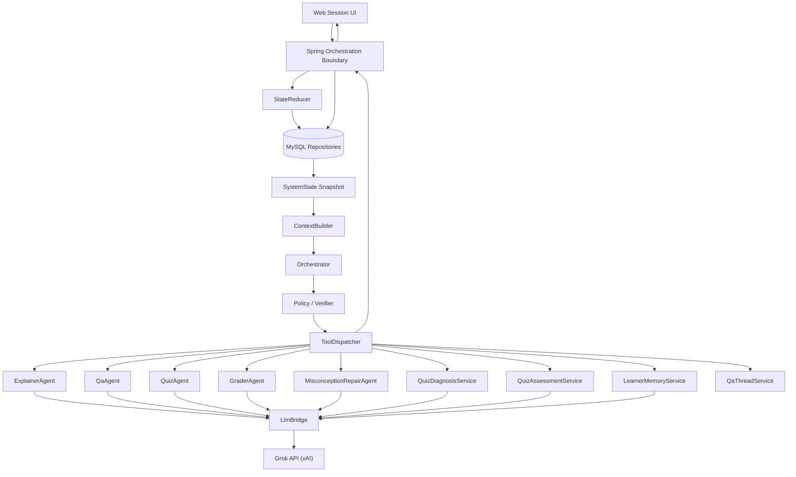

# 교육형 LMS 에이전트 시스템 상세 명세

| 항목 | 내용 |
| --- | --- |
| 상태 | 다른 팀원 구현을 위한 참고·계약 초안 |
| 마지막 갱신 | 2026-07-21 |
| 구현 소유 | FastAPI AI Server |
| 연동 소유 | Spring Backend ↔ FastAPI AI Server |

## 0. 문서 범위와 우선순위

이 문서는 EduPilot 핵심 에이전트 시스템의 역할, 입력/출력, 턴 처리, 정책, 시나리오를 보존합니다. Spring 백엔드 담당자는 FastAPI 내부 구현을 직접 소유하지 않지만, 내부 API DTO, 상태 패치, 오류, 스트리밍 계약을 설계할 때 이 문서를 참고합니다.

원안과 최종 서버 구조의 차이는 다음과 같습니다.

- 원안의 `JsonStore` 역할은 최종 구조에서 Spring과 MySQL 영속 계층이 담당합니다.
- `SystemState`는 FastAPI가 한 턴을 판단하기 위해 전달받는 논리적 스냅샷입니다.
- FastAPI는 상태 변경안을 반환하지만 영속 상태의 최종 반영과 검증은 Spring이 담당합니다.
- 원안의 ToolDispatcher 내부 MCQ/OX 채점은 최종 서버 경계에서 Spring의 결정적 채점 로직이 담당합니다.
- FastAPI 내부 세부 구현보다 [시스템 아키텍처](architecture.md)와 합의된 내부 API 계약이 우선합니다.

## 1. 전체 시스템 구조



화살표는 구현 호출 순서를 완전히 고정하는 것이 아니라 모듈과 책임 경계를 보여줍니다.

## 2. 상위 모듈 역할

### Orchestration Engine

사용자 요청과 시스템 상태를 바탕으로 문맥 구성, 계획, 정책 검증, 도구 실행, 결과 정리, 저장을 연결하는 전체 실행 흐름입니다. 분리 아키텍처에서는 Spring이 요청·영속화 경계를, FastAPI가 AI 계획·실행 경계를 담당합니다.

### StateReducer

LLM 판단이 필요 없는 이벤트를 즉시 상태 전이로 바꿉니다. 예를 들어 사용자가 PDF 뷰어에서 페이지 2로 이동하면 `currentPage=2`와 새 페이지 상태를 Spring이 결정적으로 갱신합니다. 상태가 바뀌었다는 사실만으로 별도 AI 턴이 자동 실행되는 것은 아닙니다.

### SystemState

한 학습 세션의 현재 페이지, 메시지, 퀴즈, 평가, 진단, 학습자 메모리를 묶은 논리적 상태입니다. FastAPI에는 필요한 최소 스냅샷/요약만 전달합니다.

### ContextBuilder

Orchestrator에 전달할 문맥을 만듭니다.

- 최신 세션 상태
- 현재 페이지와 필요한 이전/다음 페이지 내용
- 최근 대화와 conversation summary
- 활성 QA thread digest
- 최근 QuizAssessment
- 확정 LearnerMemory digest
- pending diagnosis와 repair 문맥

예시:

```text
현재 페이지: 3
현재 페이지: 선형회귀 기울기 공식
이전 페이지: 평균과 편차
최근 질문: "편차가 뭔지 모르겠어"
최근 퀴즈: 기울기 해석 문항 오답
학습자 메모리: 수식 전개를 어려워함
```

필요 이상으로 전체 PDF, 전체 대화, 전체 퀴즈를 매 턴 전달하지 않습니다.

### Policy / Verifier

Orchestrator Plan의 JSON 스키마와 교수 정책을 검증하고 허용되지 않는 액션을 거부·제한·보정합니다. 예를 들어 만점 퀴즈 직후 근거 없이 오개념 교정을 호출하는 Plan은 허용하지 않습니다.

### ToolDispatcher

검증된 액션을 순서대로 실행하고 결과를 표준 형태로 모읍니다. FastAPI 내부에서는 전문 에이전트/서비스 호출을 담당하고, Spring이 반영할 메시지·상태 패치·UI 액션을 반환합니다.

### LlmBridge

Grok SDK/API 세부사항을 격리합니다. 모델 선택, 파일 참조, 구조화 출력, 스트리밍, timeout, provider 오류 변환을 담당하되 도메인 정책을 결정하지 않습니다.

## 3. 멀티 에이전트 턴 처리 단계

1. **이벤트 수신**: 세션 입장, 텍스트 질문, 페이지 이동, 퀴즈 유형 선택, 퀴즈 제출, 진단 답변 등을 수신합니다.
2. **StateReducer**: LLM 없이 가능한 상태 변경을 Spring이 먼저 처리합니다. 상태 변경 자체가 새 AI 턴을 의미하지는 않습니다.
3. **컨텍스트 수집**: Spring 스냅샷을 기반으로 ContextBuilder가 필요한 문맥을 구성합니다.
4. **Plan 생성**: Orchestrator가 이번 턴의 목적, 교수 정책, 액션을 결정합니다.
5. **Plan 검증**: Policy/Verifier가 스키마, 허용 도구, 현재 상태, 교수 정책을 검사합니다.
6. **도구 실행**: ToolDispatcher가 검증된 전문 에이전트/서비스를 실행합니다.
7. **결과 수집**: 메시지, 퀴즈, 채점, 진단 등 결과를 표준 DTO로 수집합니다.
8. **런타임 상태 패치**: 설명 완료, 진단 대기 등 허용된 `statePatch`를 만듭니다.
9. **턴 결과 정리**: 사용자 입력, 에이전트 메시지, UI 액션, 실행 이력을 합칩니다.
10. **요약/평가 handoff**: 대화는 `conversationSummary`, 퀴즈 결과는 별도 QuizResultLog/Assessment에 정리합니다. 퀴즈 원본을 대화 요약에 넣지 않습니다.
11. **최종 저장**: Spring이 계약과 상태 전이를 검증한 뒤 MySQL에 트랜잭션으로 저장하고 FE에 반환합니다.

## 4. 에이전트 및 서비스 역할

### 4.1 Orchestrator

목적: 이번 턴에 무엇을 해야 하는지 판단하는 중앙 계획자입니다. 학생에게 긴 설명을 직접 작성하지 않습니다.

입력:

- 사용자 이벤트: 세션 입장, 질문, 페이지 이동, 퀴즈 선택/제출, 진단 답변
- ContextBuilder 결과: 세션 상태, 페이지 문맥, 최근 메시지, QA thread, 퀴즈 평가, 메모리
- 사용 가능한 tool 목록과 현재 정책

필수 제약:

- 먼저 `turnGoal`을 결정하고 그 후 도구를 선택합니다.
- 전문 작업은 해당 에이전트에 위임합니다.
- 단일 관찰만으로 `memoryWrite`를 만들지 않습니다.
- 사용 가능한 tool과 허용된 args만 출력합니다.
- 설명문/QA 답변을 Plan에 직접 생성하지 않습니다.
- 오류 시 임의 동작 대신 안전한 `stop`을 반환합니다.

출력 예시:

```json
{
  "schemaVersion": "1.0",
  "turnGoal": "EXPLAIN_PAGE_AND_OFFER_QUIZ",
  "pedagogyPolicy": {
    "mode": "EXPLAIN_FIRST",
    "reason": "새 페이지이므로 먼저 설명이 필요함",
    "allowDirectAnswer": true,
    "hintDepth": "MEDIUM",
    "interventionBudget": 3
  },
  "actions": [
    {
      "actionId": "a1",
      "type": "CALL_TOOL",
      "tool": "EXPLAIN_PAGE",
      "args": {
        "page": 2,
        "detailLevel": "NORMAL"
      }
    },
    {
      "actionId": "a2",
      "type": "CALL_TOOL",
      "tool": "PROMPT_BINARY_DECISION",
      "args": {
        "contentMarkdown": "퀴즈를 진행할까요?",
        "decisionType": "QUIZ_DECISION"
      }
    }
  ],
  "reason": "현재 페이지 설명 뒤 이해 확인을 제안함",
  "memoryWrite": null,
  "stop": null
}
```

### 4.2 ExplainerAgent

목적: 현재 PDF 페이지를 학생 수준과 학습 이력에 맞게 설명합니다.

입력:

- `fileRef`, `page`
- 현재 페이지 및 필요한 인접 페이지 문맥
- `detailLevel`: `NORMAL` 또는 `DETAILED`
- `learnerLevel`, `learnerMemoryDigest`

`learnerLevel`과 `learnerConfidence`는 별도 저장 컬럼 없이 Spring이 `learner_memories`(`target_difficulty`, 약점·강점)와 최근 QuizAssessment에서 파생해 turn 요청 `context`로 전달하는 요약값입니다. 값이 없으면 `null`이며 에이전트는 기본 수준으로 동작합니다. 파생 규칙은 AI/BE 공동 확정 항목입니다.

제약:

- 현재 페이지가 설명의 중심입니다.
- 이전/다음 페이지는 연결을 위한 보조 근거로만 사용합니다.
- 약점/오개념이 있으면 더 쉬운 예시와 단계적 설명을 사용합니다.
- 잘 아는 내용은 불필요하게 반복하지 않습니다.
- 퀴즈 생성, 채점, 자유 질문 답변, 오답 교정은 하지 않습니다.
- 결과 본문은 Markdown이며 수식은 필요하면 LaTeX를 사용합니다.

출력:

```json
{
  "markdown": "...",
  "thoughtSummary": "현재 페이지 핵심 개념과 학생 수준에 맞춘 설명 진행 요약"
}
```

`thoughtSummary`는 사용자 표시/관찰 가능한 짧은 작업 요약이며 비공개 내부 추론 원문이 아닙니다.

### 4.3 QaAgent

목적: 현재 학습 중인 PDF 페이지 문맥을 기준으로 학생 질문에 답합니다.

입력:

- `fileRef`, `page`, 현재 페이지 문맥
- 학생 질문
- `learnerLevel`, `learnerMemoryDigest`
- `qaThreadDigest`
- `qaThreadMode`: `START_NEW` 또는 `FOLLOW_UP`
- 교정 후 질문인 경우 직전 repair 원문/요약

제약:

- 현재 페이지를 우선 근거로 사용합니다.
- 정보가 부족하면 추측하지 않고 한계를 설명합니다.
- `START_NEW`이면 과거 thread가 전달돼도 사용하지 않습니다.
- `FOLLOW_UP`이면 이전 QA 문맥을 반드시 연결합니다.
- 퀴즈 생성, 채점, 전체 페이지 설명, 오답 교정은 하지 않습니다.
- Markdown으로 답하고 필요한 수식은 LaTeX를 사용합니다.

출력:

```json
{
  "markdown": "...",
  "thoughtSummary": "질문과 페이지 근거를 연결한 진행 요약"
}
```

### 4.4 QuizAgent

목적: 현재 페이지 또는 누적 학습 범위와 학생 상태를 바탕으로 선택된 유형의 퀴즈 JSON을 생성합니다.

입력:

- `fileRef`, `page`
- `quizType`: `MCQ`, `OX`, `SHORT`, `ESSAY`
- `coverageStartPage`, `coverageEndPage`
- `learnerLevel`, `learnerConfidence`
- `learnerMemoryDigest`, 관련 있는 `qaThreadDigest`
- `sessionId`, `materialId` 추적 정보

학습 정책:

- 문항 수 기본값은 5개이며 5~10개 범위에서 조절합니다.
- 낮은 confidence는 기초·개념 점검 비중과 필요한 문항 수를 늘립니다.
- 높은 confidence는 불필요한 반복을 줄이고 응용·심화 문항을 포함할 수 있습니다.
- 약점과 오개념을 반영하되 이미 잘하는 내용만 반복하지 않습니다.
- QA 문맥이 퀴즈 범위와 무관하면 사용하지 않습니다.

제약:

- 제공된 PDF 범위를 근거로 합니다.
- 채점과 오답 교정을 하지 않습니다.
- 설명 문장 없이 합의된 JSON만 반환합니다.
- `questionCount`와 배열 길이가 일치해야 합니다.
- 유형별 필수 정답/루브릭 필드를 생성하지만 Spring은 이를 FE 공개 DTO에서 제거합니다.

공통 출력 초안:

```json
{
  "schemaVersion": "1.0",
  "generationId": "generation-reference",
  "quizType": "MCQ",
  "page": 3,
  "coverageStartPage": 1,
  "coverageEndPage": 3,
  "title": "선형회귀 핵심 확인",
  "questionCount": 5,
  "questions": []
}
```

최종 영속 `quizId`는 Spring이 발급합니다. FastAPI가 식별자를 필요로 하면 Spring이 전달한 생성 요청 ID를 echo하거나 `generationId`를 반환하고, Spring이 이를 영속 ID와 매핑합니다.

유형별 최소 필드:

| 유형 | 공통 외 필드 |
| --- | --- |
| MCQ | `options`, `correctOptionId`, `explanation`, `maxScore` |
| OX | `correctAnswer:boolean`, `explanation`, `maxScore` |
| SHORT | `referenceAnswer`, `acceptableKeywords`, `rubric`, `maxScore` |
| ESSAY | `modelAnswer`, `rubric`, `maxScore` |

최종 스키마는 AI/BE 공동 JSON Schema로 별도 확정합니다.

### 4.5 GraderAgent

목적: SHORT/ESSAY 학생 답안을 문제 JSON과 루브릭에 따라 엄격하고 일관되게 채점합니다.

입력:

- `fileRef`, `page`
- 퀴즈 JSON: 문항, 기준 답안/모범 답안, 루브릭, 배점
- 학생 답안 JSON
- `learnerMemoryDigest` — 피드백 보완에만 사용

채점 규칙:

- 루브릭이 있으면 우선 적용합니다.
- 표현이 달라도 핵심 의미가 맞으면 정답으로 인정할 수 있습니다.
- 일부 핵심 요소 누락/오류/설명 부족은 부분점수입니다.
- 핵심이 틀리거나 비어 있거나 무관하면 오답입니다.
- `0 <= score <= maxScore`를 지킵니다.
- 판정은 `CORRECT`, `PARTIAL`, `WRONG`만 사용합니다.
- 학습자 메모리로 점수를 가감하지 않습니다.

피드백 규칙:

- 맞은 부분과 부족한 부분을 구체적으로 짚습니다.
- 단답형은 간결하게, 서술형은 논리·핵심 누락·정확성을 중심으로 작성합니다.
- 정답만 반복하지 않고 부족한 개념을 짧게 보충합니다.

출력:

```json
{
  "schemaVersion": "1.0",
  "quizId": "q-1",
  "quizType": "ESSAY",
  "score": 70,
  "maxScore": 100,
  "items": [
    {
      "questionId": "q1",
      "score": 14,
      "maxScore": 20,
      "verdict": "PARTIAL",
      "feedback": "핵심 관계는 맞지만 조건 설명이 누락되었습니다."
    }
  ]
}
```

Spring은 문항 ID, 점수 범위, 합계, 만점 일치를 다시 검증합니다.

### 4.6 MisconceptionRepairAgent

목적: 퀴즈 이후 확인된 헷갈린 지점만 짧게 교정합니다.

입력:

- `fileRef`, `page`
- 틀린 문항과 채점 결과
- `focusConcepts`, `suspectedMisconceptions`, `repairHint`
- 학생의 진단 답변을 포함한 `repairQuestion`
- `learnerLevel`, `learnerMemoryDigest`

제약:

- 전체 페이지를 처음부터 다시 설명하지 않습니다.
- 진단으로 확인된 지점과 근거가 있는 오답에 집중합니다.
- 새 퀴즈를 만들거나 채점하지 않습니다.

출력:

```json
{
  "markdown": "...",
  "focusConcepts": ["..."],
  "thoughtSummary": "교정 대상과 설명 방향의 짧은 진행 요약"
}
```

### 4.7 QuizDiagnosisService

목적: 저득점 퀴즈의 오답에서 가능한 혼동을 추정하고, 바로 정답을 주기 전에 학생에게 막힌 지점을 묻습니다.

입력:

- `quizResult`
- `wrongItems`: 문제, 학생 답, 정답/모범 답안, 채점 피드백
- `pageContext` — 퀴즈가 출제된 페이지/범위의 강의 자료 텍스트
- `learnerMemoryDigest`
- 필요한 경우 `quizAssessment`

제약:

- 학생에게 전체 해설이나 정답을 먼저 주지 않습니다.
- 퀴즈 오답, 학생 답안, 강의 문맥을 근거로 합니다.
- 단일 오답으로 수준이나 오개념을 확정하지 않습니다.
- 진단 질문은 짧고 학생이 선택/설명하기 쉬워야 합니다.

출력:

```json
{
  "focusConcepts": ["분수 나눗셈의 역수 개념", "나눗셈-곱셈 변환"],
  "suspectedMisconceptions": [
    "절차는 기억하지만 역수를 곱해야 하는 이유를 설명하지 못함",
    "계산 규칙과 개념적 의미를 분리해서 이해하고 있음"
  ],
  "diagnosticPrompt": "왜 역수를 곱하는지가 막혔나요, 아니면 계산 순서가 막혔나요?",
  "evidence": ["q2에서 변환 이유를 설명하지 못함"],
  "repairHint": "역수의 의미를 나눗셈 상황과 연결"
}
```

### 4.8 QuizAssessmentService

목적: 채점 결과를 다음 턴 Orchestrator가 참고할 내부 평가 메모로 바꿉니다.

입력:

- `quizResult`, `studentAnswers`, `quizItems`
- `fileRef`, `page`
- `learnerMemoryDigest`

제약:

- 학생에게 직접 전달할 긴 피드백을 작성하지 않습니다.
- 퀴즈와 강의 자료에 근거합니다.
- 단일 퀴즈로 학생 수준을 과도하게 단정하지 않습니다.
- 다음 행동을 강제하지 않고 Orchestrator 참고 힌트를 제공합니다.

출력:

```json
{
  "understandingSummary": "...",
  "strengths": ["..."],
  "weaknesses": ["..."],
  "suspectedMisconceptions": ["..."],
  "recommendedNextDirection": "REVIEW",
  "memoryCandidates": [
    {
      "type": "WEAKNESS",
      "content": "...",
      "confidence": "LOW"
    }
  ],
  "evidence": ["..."]
}
```

### 4.9 LearnerMemoryService

목적: 반복적으로 확인된 학습 패턴을 개인화 메모리 후보로 정리하고, 승인된 경우 장기 메모리 스냅샷을 갱신합니다.

입력:

- `quizAssessment`
- `diagnosisResult`
- `repairResult`
- `qaHistory`
- `currentMemory`
- 승격 시 Orchestrator의 검증된 `memoryWrite`

관리 필드:

- `strengths`
- `weaknesses`
- `misconceptions`
- `explanationPreferences`
- `preferredQuizTypes`
- `targetDifficulty`
- `nextCoachingGoals`
- `memoryDigest`

제약:

- 첫 관찰은 임시 후보로만 둡니다.
- 서로 독립된 여러 근거에서 반복 확인된 경우에만 승격 후보가 됩니다.
- 메모리는 짧고 구체적이며 다음 에이전트가 바로 사용할 수 있어야 합니다.
- 근거 없이 성격, 지능, 능력을 추론하지 않습니다.

출력 초안:

```json
{
  "temporaryCandidates": [],
  "promotedMemory": {
    "strengths": [],
    "weaknesses": [],
    "misconceptions": [],
    "explanationPreferences": [],
    "preferredQuizTypes": [],
    "targetDifficulty": "BALANCED",
    "nextCoachingGoals": [],
    "memoryDigest": "..."
  },
  "evidenceRefs": []
}
```

### 4.10 QaThreadService

목적: 같은 페이지/설명/교정 흐름에서 이어지는 질문·답변 문맥을 짧게 유지합니다. Spring이 원본 메시지와 스레드 상태를 저장하고 FastAPI에는 필요한 digest를 전달합니다.

## 5. 시스템 상태 정의

논리 상태 예시:

```json
{
  "schemaVersion": "1.0",
  "session": {
    "sessionId": 100,
    "userId": 1,
    "materialId": 10,
    "currentPage": 3,
    "pageStatus": "EXPLAINED",
    "status": "ACTIVE"
  },
  "conversation": {
    "recentMessages": [],
    "conversationSummary": "...",
    "qaThreadDigest": null
  },
  "quiz": {
    "activeQuiz": null,
    "recentResultLogs": [],
    "recentAssessments": []
  },
  "diagnosis": {
    "pendingDiagnosis": null,
    "latestRepair": null
  },
  "memory": {
    "learnerMemoryDigest": null,
    "temporaryCandidates": []
  }
}
```

상태 원칙:

- 대화 요약과 퀴즈 원본/결과를 섞지 않습니다.
- FastAPI에는 원본 전체 대신 현재 턴에 필요한 범위만 전달합니다.
- `pendingDiagnosis`가 있으면 무관한 교정 액션을 중복 실행하지 않습니다.
- 임시 메모리 후보와 확정 LearnerMemory를 구분합니다.
- FastAPI의 상태 패치는 Spring 허용 목록을 통과해야 합니다.

## 6. 에이전트 통신 프로토콜

### Plan 공통 필드

| 필드 | 설명 |
| --- | --- |
| `schemaVersion` | 계약 버전 |
| `turnGoal` | 이번 턴의 단일 주목적 |
| `pedagogyPolicy` | 난이도, 설명 모드, 힌트 깊이 등 |
| `actions` | 순서가 있는 실행 액션 |
| `reason` | 정책 검증/디버깅용 짧은 이유 |
| `memoryWrite` | 근거가 충분한 경우에만 존재 |
| `stop` | 안전하게 중단할 사유/사용자 안내 |

### 허용 도구 초안

자유 학습 턴(`/internal/ai/turn`)의 Plan에서 사용할 수 있는 도구:

- `EXPLAIN_PAGE`
- `ANSWER_QUESTION`
- `GENERATE_QUIZ_MCQ`
- `GENERATE_QUIZ_OX`
- `GENERATE_QUIZ_SHORT`
- `GENERATE_QUIZ_ESSAY`
- `REPAIR_MISCONCEPTION`
- `BUILD_MEMORY_CANDIDATE`
- `PROMOTE_MEMORY`
- `PROMPT_BINARY_DECISION`
- `PROMPT_QUIZ_TYPE_SELECTION`

Spring 결정적 파이프라인 전용 기능(자유 턴 Plan에서 사용 금지 — Policy가 거부):

- `GRADE_OPEN_RESPONSE` → `/internal/ai/grade` (SHORT/ESSAY 제출 시)
- `ASSESS_QUIZ_RESULT` → `/internal/ai/quiz-assessment` (채점 완료 후 항상)
- `DIAGNOSE_MISCONCEPTION` → `/internal/ai/diagnosis` (기준 점수 미달 시)

이 세 기능은 트리거가 이벤트 타입·점수 기준으로 결정적이어서 Orchestrator 계획 없이 Spring이 순차 호출합니다([API 명세](api-spec.md) §8). 페이지 이동과 MCQ/OX 채점은 Spring 액션이며 FastAPI 도구 목록에 넣지 않는 것을 기본안으로 합니다.

### 액션 실행 결과

```json
{
  "actionId": "a1",
  "tool": "EXPLAIN_PAGE",
  "status": "SUCCESS",
  "userOutput": {
    "messageType": "EXPLANATION",
    "content": "..."
  },
  "artifacts": {},
  "statePatch": {
    "pageStatus": "EXPLAINED"
  },
  "error": null
}
```

### 오류와 fallback

- 스키마 오류: 한 번의 구조화 재생성/수정 시도 후 실패 응답을 반환하는 방안을 검토합니다.
- 알 수 없는 tool/args: 실행하지 않고 Policy 오류로 중단합니다.
- Grok timeout/rate limit: 제한된 정책에 따라 재시도하고 Spring에 분류된 오류를 반환합니다.
- 일부 액션 성공 후 후속 액션 실패: 성공 artifact와 실패 지점을 명시하고 Spring이 원자 반영 여부를 결정합니다.
- 근거 부족: 답을 꾸며내지 않고 한계 안내 메시지를 생성합니다.
- 필수 문맥 누락: 안전한 stop과 필요한 입력을 반환합니다.

## 7. 정책과 ToolDispatcher 원칙

### 정책 검증

- 현재 상태에서 허용된 tool인가? (파이프라인 전용 기능이 자유 턴 Plan에 등장하면 거부)
- 통과한 퀴즈에 근거 없이 교정을 호출하지 않는가?
- 진단 답변 전 RepairAgent를 호출하지 않는가?
- 새 QA와 후속 QA의 thread mode가 일치하는가?
- 페이지 범위와 퀴즈 범위가 유효한가?
- 메모리 승격에 반복 근거가 있는가?
- action 수와 intervention budget을 넘지 않는가?

파이프라인 구간 규칙("퀴즈 타입과 채점 도구 일치", "통과한 퀴즈에 진단을 실행하지 않음")은 하이브리드 원칙에 따라 Spring의 이벤트 타입·점수 기준 규칙이 구조적으로 집행합니다. Policy/Verifier는 자유 턴 Plan에 대해서만 위 검증을 수행합니다.

### Dispatcher 실행

- action 순서와 선행조건을 지킵니다.
- 각 결과를 JSON Schema로 검증합니다.
- 사용자 메시지와 내부 artifact를 분리합니다.
- 퀴즈 정답/루브릭을 UI action에 포함하지 않습니다.
- 허용된 상태 패치만 합칩니다.
- 동일 action/turn ID 중복 실행 방지 전략을 둡니다.

## 8. 실시간 스트리밍

- 답변 content chunk와 사용자 표시용 `thoughtSummary`/진행 상태를 점진적으로 전달합니다.
- ToolDispatcher에서 Spring과 Frontend까지 전달하는 기본 외부 스트림은 SSE를 사용합니다.
- Grok의 스트리밍·구조화 출력 지원 방식은 실제 사용 모델의 공식 가이드를 기준으로 구현 시 확인합니다.
- `thoughtSummary`는 내부 chain-of-thought가 아니라 짧은 처리 단계/근거 요약입니다.
- ToolDispatcher는 청크를 표준 스트림 이벤트로 변환하고 Spring이 FE에 중계합니다.
- 완료 전에 받은 청크는 임시 UI 상태이며, 최종 결과 검증 후 확정 저장합니다.
- 중단, 취소, 재연결, 마지막 이벤트 ID 정책은 FE/BE/AI가 공동 확정합니다.

이벤트 후보:

```text
status
thought_summary
content_delta
ui_action
completed
error
```

## 9. 핵심 기능 시나리오

### 9.1 일반 강의: 페이지 1 → 페이지 2

1. 세션 진입 시 페이지 1과 `강의를 시작할까요?` UI를 표시합니다.
2. 아니오면 상태를 유지하고 다음 이벤트를 기다립니다.
3. 예이면 Orchestrator가 설명 Plan을 만들고 ExplainerAgent를 실행합니다.
4. 설명을 메시지로 저장·표시한 뒤 `다음 페이지로 이동할까요?` UI를 제공합니다.
5. 예이면 Spring StateReducer가 페이지 2로 이동하고 PDF 뷰어를 동기화합니다.
6. 페이지 2에서 다시 설명 여부를 묻습니다.

### 9.2 임의 질문과 후속 질문

1. 사용자가 설명과 관련된 질문을 전송합니다.
2. Orchestrator가 QA 목적과 새/후속 thread mode를 결정합니다.
3. QaAgent가 현재 페이지, 질문, 메모리, 해당 QA 문맥으로 답합니다.
4. 질문·답변을 QaThread에 저장합니다.
5. 같은 문맥의 추가 질문은 기존 thread digest를 사용합니다.

### 9.3 QA에서 메모리 후보 생성

1. 구체적인 혼동 설명, 자기 점검, 반복 질문 등 의미 있는 패턴이 나타납니다.
2. Orchestrator가 필요하면 LearnerMemoryService 후보 생성 액션을 추가합니다.
3. 후보는 임시 메모리에 저장되며 즉시 장기 메모리가 되지 않습니다.
4. 이후 독립적인 근거가 반복되면 별도 `memoryWrite`로 승격합니다.

### 9.4 설명 후 퀴즈 생성과 제출

1. 중요 페이지 설명 후 퀴즈 유형 선택 UI를 표시합니다.
2. 사용자가 유형을 선택하면 `QUIZ_TYPE_SELECTED` 이벤트가 발생합니다.
3. QuizAgent가 합의된 범위와 유형으로 문제를 생성합니다.
4. Spring은 문제와 비공개 정답/루브릭을 저장하고 FE에 공개 문제만 제공합니다.
5. 사용자가 답안을 제출하면 채점 흐름으로 이동합니다.

### 9.5 MCQ/OX 제출

1. Spring이 저장 정답으로 즉시 채점합니다.
2. 제출과 문항별 결과를 저장합니다.
3. QuizAssessmentService가 내부 평가 JSON을 생성합니다.
4. 최근 평가 큐에 추가합니다.
5. 점수가 높으면 다음 학습을, 낮으면 진단 흐름을 제안합니다.

### 9.6 SHORT/ESSAY 제출

1. Spring이 답안 구조와 소유권을 검증합니다.
2. FastAPI GraderAgent가 루브릭 기반 결과를 반환합니다.
3. Spring이 점수/합계/문항 ID를 재검증해 저장합니다.
4. QuizAssessment를 생성하고 다음 행동 판단에 사용합니다.

### 9.7 평가 메모리의 장기 메모리 승격

1. 여러 QuizAssessment에서 같은 약점/오개념/선호 패턴이 반복됩니다.
2. Orchestrator가 LearnerMemoryService를 호출해 임시 후보를 정리합니다.
3. 추가 퀴즈·QA·교정에서 독립 근거가 쌓입니다.
4. 검증된 `memoryWrite`가 있을 때만 장기 LearnerMemory로 반영합니다.
5. 승격된 임시 후보는 삭제 또는 archive하고 근거 참조를 남깁니다.

### 9.8 저득점 오개념 교정

1. MCQ/OX는 Spring, SHORT/ESSAY는 GraderAgent가 채점합니다.
2. 기준 미달이면 QuizAssessment와 QuizDiagnosis를 생성합니다.
3. 진단 질문과 `pendingDiagnosis`를 저장하고 사용자에게 표시합니다.
4. 사용자가 답하면 `DIAGNOSIS_ANSWER_SUBMITTED`가 발생합니다.
5. ContextBuilder가 오답, 평가, 진단, 답변을 묶습니다.
6. MisconceptionRepairAgent가 확인된 혼동만 짧게 교정합니다.
7. diagnosis/repair 결과는 근거로 저장하지만 즉시 장기 메모리로 확정하지 않습니다.

### 9.9 교정 후 추가 질문

1. 사용자가 교정 설명에 추가 질문을 합니다.
2. 이벤트는 별도 타입 없이 `USER_QUESTION`이며, Spring이 스냅샷 `context.latestRepair`에 직전 교정 답변 원문(또는 원문을 보존한 요약)을 포함해 전달합니다.
3. Orchestrator는 `latestRepair` 문맥으로 교정 후속 여부를 판단하고 RepairAgent가 아니라 QaAgent를 선택합니다.
4. 직전 교정 내용과 질문, 현재 페이지, QaThread를 전달합니다.
5. 이후 같은 흐름의 질문은 QaThread로 이어갑니다.

### 9.10 StateReducer 페이지 이동

1. 사용자가 PDF 뷰어에서 다음/이전/특정 페이지를 선택합니다.
2. Spring이 유효 범위를 검증하고 현재 페이지를 바꿉니다.
3. FE는 서버 응답 페이지로 뷰어를 동기화합니다.
4. 새 페이지 설명 여부 UI를 표시합니다.
5. 이 과정에는 LLM을 호출하지 않습니다.

## 10. 시나리오 성공 기준

| 시나리오 | 성공 기준 |
| --- | --- |
| 페이지 설명 | 현재 페이지 중심 설명이 한 번 저장되고 상태가 `EXPLAINED`로 일치 |
| 페이지 이동 | Spring/DB/FE PDF 뷰어의 페이지가 같고 AI 호출 없음 |
| QA | 새/후속 thread 문맥이 섞이지 않고 질문·답변이 복원 가능 |
| 퀴즈 생성 | 범위·유형·문항 수·스키마가 유효하고 정답이 FE에 노출되지 않음 |
| MCQ/OX 채점 | 저장 정답으로 결정적으로 재현 가능 |
| SHORT/ESSAY 채점 | 루브릭, 점수 범위, 합계가 일치하고 판정 enum이 유효 |
| 저득점 진단 | 교정 전에 진단 질문이 표시되고 pending 상태가 복원 가능 |
| 오개념 교정 | 전체 재설명이 아닌 확인된 혼동 지점만 교정 |
| 메모리 승격 | 여러 근거가 있고 단일 결과로 장기 메모리가 바뀌지 않음 |
| 실패 복구 | AI timeout/스키마 실패/재전송에도 중복 기록이나 상태 손상 없음 |
| 스트리밍 | 임시 청크와 확정 메시지가 구분되고 중단 시 불완전 상태가 안전함 |

## 11. AI/BE 공동 확정 항목

- 각 agent JSON Schema와 `schemaVersion` 호환 정책
- Orchestrator 허용 tool 목록과 args
- Plan 보정과 완전 거부의 기준
- 모델/파일 참조 방식과 페이지 근거 전달 방식
- timeout, 재시도, rate limit, fallback 모델 정책
- 부분 액션 성공 시 Spring 반영 원자성
- 평가 큐 크기와 메모리 승격 근거 기준
- SSE 이벤트 schema와 heartbeat·취소·재연결
- AI 결과 및 prompt/response의 로그·보관·마스킹 정책
