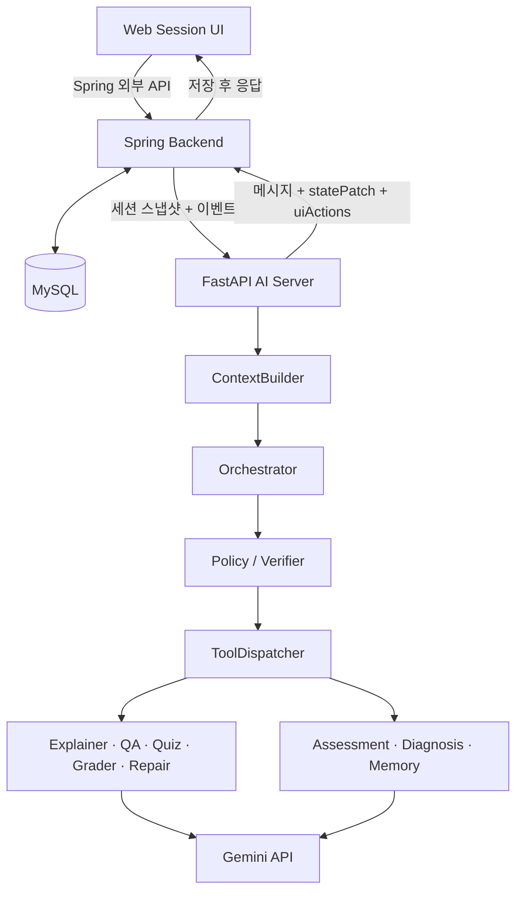
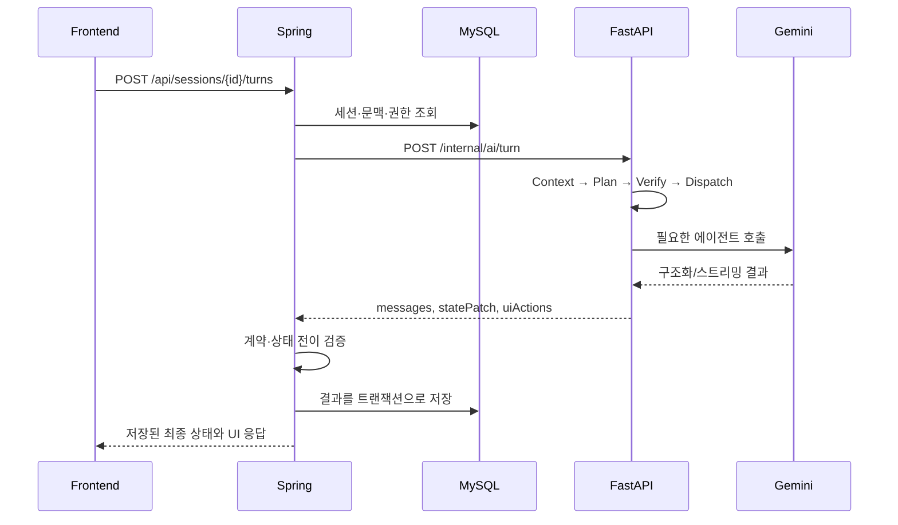

# 시스템 아키텍처

| 항목 | 내용 |
| --- | --- |
| 상태 | 초안 |
| 마지막 갱신 | 2026-07-20 |
| 기준 | Spring 백엔드 중심 설계 |

## 1. 전체 구조

## 2. 서버별 책임

### Frontend

- 로그인/회원가입, 자료 목록, 학습 세션 화면을 제공합니다.
- PDF 뷰어와 서버의 `currentPage`를 동기화합니다.
- 채팅, 선택 UI, 퀴즈, 진단 질문, 스트리밍 청크를 렌더링합니다.
- 에이전트 종류나 FastAPI 내부 엔드포인트를 알지 않습니다.

### Spring Backend

- 인증·인가와 사용자/자료/세션 도메인을 소유합니다.
- `LearningSession`, 메시지, 퀴즈, 제출, 평가, 진단, 교정, 메모리를 영속화합니다.
- 페이지 이동 등 LLM 판단이 필요 없는 이벤트를 `StateReducer` 규칙으로 처리합니다.
- MCQ/OX를 결정적으로 채점합니다.
- FastAPI에 필요한 문맥을 조회하여 내부 API를 호출하고, 반환 결과를 검증·저장한 후 FE에 전달합니다.
- 자유 학습 턴은 `/internal/ai/turn` 단일 진입점으로 전달하고 에이전트 선택은 FastAPI Orchestrator에 위임합니다. 퀴즈 제출 후의 결정적 파이프라인(SHORT/ESSAY 채점 → 내부 평가 → 저득점 시 진단)만 이벤트 타입·점수 기준 규칙에 따라 전용 내부 API를 순차 호출합니다([API 명세](api-spec.md) §8 참고).
- 멱등성, 트랜잭션 경계, 권한, 입력 검증을 책임집니다.

### FastAPI AI Server

- 현재 턴 문맥을 구성하고 목적과 실행 계획을 결정합니다.
- 계획 JSON을 스키마와 교수 정책에 따라 검증합니다.
- 전문 에이전트와 AI 서비스를 실행합니다.
- Spring이 저장할 메시지, 상태 패치, UI 액션, 메모리 후보를 구조화해 반환합니다.
- Spring의 영속 데이터를 독립적으로 수정하지 않습니다.

## 3. 논리 모듈 배치

| 모듈 | 배치 | 설명 |
| --- | --- | --- |
| Auth/User/Material/Session Service | Spring | 핵심 비즈니스 도메인 |
| StateReducer | Spring | 결정 가능한 즉시 상태 전이 |
| QuizRecord/QaThread | Spring | 기록과 문맥 영속화 |
| AiClient | Spring | FastAPI 내부 API 어댑터 |
| ContextBuilder | FastAPI | Spring 스냅샷을 에이전트 입력으로 구성 |
| Orchestrator | FastAPI | 이번 턴의 목적과 Plan 생성 |
| PolicyVerifier | FastAPI | Plan 스키마·정책 검증/보정 |
| ToolDispatcher | FastAPI | 검증된 액션 실행 |
| 전문 에이전트 | FastAPI | 설명, QA, 퀴즈, 채점, 교정 |
| GeminiBridge | FastAPI | Gemini API 호출 격리 |

## 4. 일반 턴 처리

## 5. 상태의 기준

- 논리적 `SystemState`는 한 턴을 계획하는 데 필요한 세션 상태 모음입니다.
- 영속 상태의 기준은 Spring이 MySQL에서 관리하는 도메인 데이터입니다.
- FastAPI의 응답은 `statePatch` 제안이며, Spring이 허용된 전이인지 검증한 뒤 반영합니다.
- 에이전트 원안의 `JsonStore`는 런타임 실험용 개념으로만 참고하고 운영 영속 저장소로 사용하지 않습니다.

## 6. 스트리밍 원칙

- Frontend와 Spring 사이의 기본 전송 방식은 SSE입니다. WebSocket은 양방향 실시간 통신이 필수가 되는 경우에만 별도 결정으로 검토합니다.
- 사용자에게 표시하는 `thoughtSummary`는 모델이 별도 출력하도록 합의한 짧은 진행 요약이며, 비공개 내부 추론 원문을 노출하거나 저장하는 개념이 아닙니다.
- Spring은 인증, 연결 수명, 취소, 오류 종료 이벤트를 책임집니다.
- 최종 메시지와 상태는 SSE 완료 이벤트와 최종 결과 검증 후 한 번만 확정 저장합니다.

## 7. 실패 원칙

- FastAPI 또는 Gemini 실패 시 Spring의 기존 세션 상태를 손상시키지 않습니다.
- 부분 실행된 액션은 액션 ID/턴 ID를 사용해 중복 저장을 방지해야 합니다.
- AI 출력의 스키마 오류는 `PolicyVerifier`와 Spring 양쪽 경계에서 방어합니다.
- 외부 응답 원문, 토큰, PDF 민감 내용은 필요 이상 로그에 남기지 않습니다.
