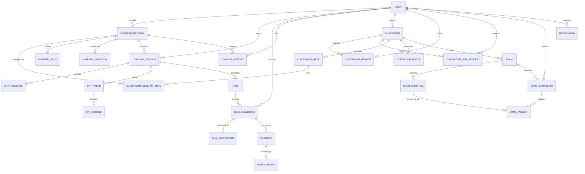

# 도메인 모델 문서

| 항목 | 내용 |
| --- | --- |
| 상태 | 초안 |
| 마지막 갱신 | 2026-08-02 |
| 범위 | Spring 소유 영속 도메인 |

## 1. 도메인 경계

| 도메인 | 주요 모델 | 책임 |
| --- | --- | --- |
| Identity | User | 인증 주체, 역할, 계정 상태 |
| Material | LearningMaterial, MaterialPage, MaterialOverview | PDF 메타데이터, 페이지 문맥과 자료 개요 |
| Classroom | Classroom, ClassroomMember, ClassroomJoinRequest, ClassroomWeek, ClassroomWeekMaterial, ClassroomNotice | 강의실 소유권, 참여, 주차 자료, 즉시·예약 공지 |
| Notification | Notification | 사용자 귀속 인앱 알림, 읽음·보관 수명 |
| Learning | LearningSession, ChatMessage | 현재 학습 상태와 대화 기록 |
| QA | QaThread, QaMessage | 이어지는 질문 문맥 |
| Quiz | Quiz, QuizSubmission, QuizAssessment | 문제 원본, 제출·채점, 내부 평가 |
| Exam | Exam, ExamQuestion, ExamSubmission, ExamAnswer | 강사 출제 시험, 재응시, 문항별 채점 결과 |
| Repair | Diagnosis, RepairResult | 진단 질문과 오개념 교정 |
| Personalization | LearnerMemory | 반복 근거 기반 장기 개인화 정보 |

DEC-030에 따라 강의실 최소셋을 MVP 영속 모델에 포함하고 인앱 알림은 자료·공지·입장 요청 네 트리거로 한정합니다. Course, Lecture, Assignment, File과 이메일·푸시·학습 리마인더는 범위 밖입니다.

## 2. 엔티티 관계

## 3. 핵심 모델

### User

- 이메일은 중복될 수 없습니다.
- 비밀번호 원문을 저장하지 않습니다.
- 역할은 `LEARNER`, `INSTRUCTOR`, `ADMIN`입니다. 공개 가입은 `LEARNER | INSTRUCTOR`만 허용하고 `ADMIN`은 기능 미구현·예약 상태로 유지합니다(DEC-017, DEC-029 Accepted).
- `LEARNER`와 `INSTRUCTOR`는 개인 PDF 업로드와 개인 통합학습을 사용할 수 있습니다. 강의실 개설·관리·자료 연결은 소유 `INSTRUCTOR`만 가능하고, `LEARNER`와 타 강의실에 참여한 `INSTRUCTOR`는 승인 멤버로서 공개 자료를 조회·학습할 수 있습니다(DEC-030).
- 상태는 `ACTIVE`, `DELETED`입니다. 탈퇴(DEC-028)는 논리 삭제 + 즉시 익명화(email → `deleted_{id}`, name 고정 문구, password_hash 무효화)이며 복구는 MVP 미지원입니다. 유예 기간·물리 삭제 배치는 이후 개선안입니다.

### LearningMaterial

- PDF 파일과 학습용 메타데이터를 나타냅니다.
- 처리 상태는 `PROCESSING → READY | FAILED`이며 `READY`만 학습 가능합니다.
- FAILED 전이는 자유 텍스트 대신 `EXTRACTION_FAILED | PAGE_LIMIT_EXCEEDED | SCHEDULING_FAILED | UNSUPPORTED_FORMAT | ENCRYPTED_PDF | NO_TEXT_CONTENT | FILE_TOO_LARGE` 사유 코드와 업로드 요청 traceId를 저장합니다. V23 이전 FAILED 자료는 두 값이 null일 수 있고, FAILED가 아닌 자료에는 실패 메타데이터를 노출하지 않습니다.
- 전역 자료 목록·수정·삭제는 소유자 전용이고 삭제는 `ACTIVE → DELETED` 논리 전이입니다. 승인된 강의실 멤버는 주차 상태와 관계없이 연결 자료의 상세·원본 파일을 조회하고 본인 통합학습 세션을 생성할 수 있지만 자료를 수정·삭제·연결할 수 없습니다.
- 원본 물리 경로 대신 저장소 독립적인 `storageKey`를 저장하며, 삭제 시 파일과 페이지 문맥은 보존합니다.
- 비동기 추출 결과는 적용 직전에 상태를 다시 확인하고, 그 사이 삭제됐다면 폐기합니다.

### MaterialPage

- `(materialId, pageNumber)`는 유일합니다.
- 페이지 번호는 1부터 시작합니다.
- 추출 텍스트는 AI 문맥이며 원본 PDF의 유일한 표현으로 간주하지 않습니다.

### MaterialOverview

- 자료당 최대 하나의 개요를 저장하며 상태는 `PENDING | READY | FAILED`입니다.
- READY가 아닌 상태의 조회 응답에서는 `content`를 노출하지 않습니다.
- 저장 행이 없으면 조회 API가 `PENDING`, `content=null`, `updatedAt=null`을 합성합니다.
- V28 범위는 저장 구조와 조회뿐이며 개요 생성·AI 호출은 후속 이슈에서 구현합니다.

### Classroom / ClassroomMember

- 강의실은 한 명의 `INSTRUCTOR`가 소유하며 `ACTIVE | COMPLETED` 상태를 가집니다. `COMPLETED`는 명시적 전환이고 날짜 경과로 자동 전환하지 않습니다.
- `weekCount`와 `currentWeek`은 저장하지 않고 날짜에서 계산합니다. `currentWeek`의 날짜 기준은 `Asia/Seoul`입니다.
- 초대 코드는 대문자·숫자의 `XXXX-XXXX` 형식이며 재발급하면 기존 코드는 즉시 무효화됩니다.
- 승인 멤버는 역할과 무관하게 `(classroomId, userId)`당 하나입니다. `INSTRUCTOR`도 본인이 소유하지 않은 강의실에는 참여할 수 있으며 MVP에서는 탈퇴·강퇴를 지원하지 않습니다.
- 완료 강의실은 기존 멤버에게 공개 자료 조회와 본인 통합학습을 유지하고 강의실 관리 쓰기는 거부합니다.

### ClassroomJoinRequest

- 상태는 `PENDING | APPROVED | REJECTED`입니다.
- `(classroomId, userId)`당 한 행을 유지합니다. `REJECTED` 후 재요청은 같은 행을 `PENDING`으로 갱신하고 `requestedAt`을 새로 기록하며 `processedAt`을 비웁니다.
- 승인 시 같은 트랜잭션에서 `ClassroomMember`를 생성합니다. 이미 처리된 요청은 다시 승인·거절할 수 없습니다.

### ClassroomWeek / ClassroomWeekMaterial

- 주차 번호는 `1 <= weekNumber <= weekCount`이고 `(classroomId, weekNumber)`는 유일합니다. 시험·리포트·자료가 참조하는 의미 식별자이므로 표시 순서 변경으로 수정하지 않습니다.
- 주차 상태는 `PRIVATE | SCHEDULED | PUBLISHED | BREAK` 정본으로 저장하고 `displayOrder`를 별도로 관리합니다.
- 학습자와 강사는 모든 주차와 연결 자료를 조회합니다. `PRIVATE | SCHEDULED | PUBLISHED | BREAK` 상태와 `releaseAt`은 표시 전용이며 자료 접근·진도·분석·리포트 선별을 제한하지 않습니다. 자료 접근은 강의실 멤버십과 자료 소유권을 기준으로 검증합니다.
- 자료 연결은 `(weekId, materialId)`당 하나입니다. 주차 삭제는 연결을 제거하지만 자료 자체를 삭제하지 않습니다.

### ClassroomNotice

- `weekNumber`는 nullable이며 null이면 전체 공지, 값이 있으면 강의실의 계산된 `weekCount` 범위 안이어야 합니다.
- `publishAt`은 nullable UTC 시각이며 null 또는 과거이면 즉시 게시하고 미래이면 조회 시각이 도래한 뒤 학습자에게 노출합니다. 공지 API 노출 판정은 조회 시각에 파생하며 강사는 예약 공지를 포함한 전체를 조회합니다.
- 기존 `publishedAt`은 공지 생성 시각과 목록 정렬·캘린더 `NOTICE_PUBLISH` 파생 기준을 유지합니다. `notificationSentAt`은 예약 공지 알림의 1회 생성 표식이며 공지 자체의 게시 상태가 아닙니다. 공지 삭제는 물리 삭제합니다.

### Notification

- 알림은 한 사용자에게 귀속하며 `MATERIAL_UPLOADED | NOTICE_PUBLISHED | JOIN_REQUEST_RECEIVED | JOIN_REQUEST_PROCESSED` 네 유형만 저장합니다.
- `link`는 FE 라우팅에 필요한 리소스 식별자만 담고, `readAt=null`은 읽지 않음을 뜻합니다. 읽음 처리는 최초 시각을 보존하는 멱등 전이입니다.
- 강의실 멤버 대상 알림은 멤버를 로드하지 않고 DB `INSERT ... SELECT`로 일괄 생성합니다. 예약 공지는 공지 행 잠금 아래 알림 생성과 `notificationSentAt` 갱신을 한 트랜잭션으로 처리합니다.
- 생성 후 30일을 초과한 알림은 배치 물리 삭제하며 이메일·푸시 전송은 하지 않습니다.

### LearningSession

- 한 명의 사용자와 하나의 자료에 속합니다.
- 강의실 식별자를 저장하지 않습니다. 동일 사용자의 동일 자료 세션과 설명 완료 이력은 개인 학습과 여러 강의실에서 공유합니다.
- `currentPage`는 자료의 유효 페이지 범위 안에 있어야 합니다.
- 현재 페이지의 런타임 상태는 단일 `pageStatus`로 유지하고, 여러 페이지의 설명 완료 근거는 `SessionPageRecord`로 분리합니다.
- `conversationSummary`는 대화 요약이며 퀴즈 원본 저장소가 아닙니다.

### SessionPageRecord

- 성공한 설명 턴이 `pageStatus=EXPLAINED`로 확정된 세션·페이지를 기록합니다.
- `(sessionId, pageNumber)`는 유일하며 재설명 시 새 행 대신 `explainedAt`을 갱신합니다.
- 페이지별 전체 학습 상태나 설명 원문을 저장하지 않고 진도율의 결정적 근거로만 사용합니다.

### ChatMessage

- UI에 표시된 사용자·AI·시스템 메시지의 기준 기록입니다.
- `messageType`으로 일반 텍스트, 설명, QA, 진단, 교정을 구분합니다.
- 스트리밍 도중의 미완료 청크와 최종 메시지는 구분해야 합니다.

### QaThread / QaMessage

- 같은 페이지/설명/교정 문맥의 이어지는 질문을 묶습니다.
- 한 세션의 활성 스레드는 하나로 운영합니다. `START_NEW`는 기존 ACTIVE 스레드를 `CLOSED`로 바꾸고 새 스레드를 생성합니다.
- `FOLLOW_UP`은 같은 세션의 ACTIVE `qa-{id}`만 허용하며 타 세션·종료 스레드 참조는 정책 위반으로 거부합니다.
- AI 호출 전에 저장된 사용자 메시지와 최종 저장된 QA 메시지를 `qa_messages.chat_message_id`로 연결합니다.

### Quiz

- 생성 당시의 페이지 범위, 타입, 공개 문제, 비공개 정답/루브릭을 보존합니다.
- 문제 생성 이후 내용은 제출 이력의 재현성을 위해 수정하지 않는 것을 원칙으로 합니다.
- FE용 DTO에 정답/루브릭을 포함하지 않습니다.

### QuizSubmission

- 한 번의 사용자 답안과 채점 결과를 나타냅니다.
- 총점은 문항별 점수 합과 일치해야 하며 `0 <= score <= maxScore`입니다.
- MVP는 1회 제출 제한(DEC-009)이며 `attempt_no`는 1로 고정합니다. 재제출 확장 시 attempt 관리와 정답 보호 규칙을 함께 도입합니다.

### QuizAssessment

- 다음 턴 오케스트레이터용 내부 평가 메모입니다.
- 학습자에게 직접 보여주는 피드백과 구분합니다.
- 단일 Assessment를 장기 성향으로 확정하지 않습니다.

### Exam / ExamQuestion

- 시험은 강의실에 귀속하며 `weekNumber`는 nullable 표시·집계 라벨입니다. 주차 번호가 있으면 강의실의 계산된 `weekCount` 안에 있어야 하지만 `ClassroomWeek` 행 존재는 요구하지 않습니다.
- 상태는 `DRAFT → PUBLISHED → CLOSED` 단방향입니다. DRAFT는 문항 0개와 불완전한 rubric을 허용하고, 공개 시 문항·총점·비공개 정답·rubric 불변식을 검증합니다.
- 강사가 전달한 문항 배열은 DRAFT에서만 전체 교체합니다. 공개 이후 문항·설정 수정과 삭제는 금지하고 CLOSED 전환으로 종료합니다.
- 공개 문항 JSON과 정답·모범 답안·rubric이 담긴 비공개 JSON을 분리합니다. 학생 조회와 제출 결과에는 DEC-031 D4 확정 전까지 비공개 필드를 포함하지 않습니다.
- 완료 강의실에서는 생성·수정·공개를 차단하지만, 기존 PUBLISHED 시험 마감과 DRAFT 시험 삭제는 정리 작업으로 허용합니다.

### ExamSubmission / ExamAnswer

- 제출은 `(examId,userId,attemptNo)`로 시도를 보존합니다. attemptNo는 상태와 무관하게 증가합니다. 운영 조회·polling의 최신 시도는 전체 `MAX(attemptNo)`, 성적·리포트 대표값은 `MAX(attemptNo WHERE status=GRADED)`입니다. `GRADED 80점 → GRADING_FAILED`이면 이전 80점이 대표 성적입니다.
- 같은 `requestId`는 같은 제출을 반환합니다. 새 재응시는 반드시 새 requestId를 사용합니다.
- 상태는 `SUBMITTED → GRADED | GRADING_FAILED`입니다. 응답 있는 SHORT/ESSAY가 있으면 202/SUBMITTED로 먼저 반환하고, 결정적 채점만 필요하면 200/GRADED로 반환합니다. 두 응답의 DTO 스키마는 같습니다.
- SUBMITTED 동안 제출 총점·정규화·채점 시각과 모든 문항의 점수·판정·피드백을 null로 마스킹합니다. 내부에서 완료된 MCQ/OX 결과도 terminal 상태 전에는 공개하지 않아 재응시 정보 이득을 막습니다.
- MCQ/OX는 Spring이 결정적으로 채점합니다. 응답이 있는 SHORT/ESSAY는 기존 grade 내부 API를 유형별 최대 1회씩 호출하고, 한 유형이 실패해도 나머지 유형 호출을 계속합니다. 점수 합계와 0~100 정규화는 Spring이 계산합니다.
- grade의 `AI_REQUEST_INVALID`은 Spring 계약 결함입니다. 비동기 worker는 재시도하지 않고 `GRADING_FAILED`로 종결하며 ERROR 로그로 일반 AI 실패와 구분합니다.
- AI 대상 답안은 채점 완료 전·실패 시 점수와 판정이 없습니다. 미응답 문항만 `answer=null`, 0점, `WRONG`으로 즉시 확정하며 AI 호출에서 제외합니다.
- GRADING_FAILED는 응시권을 소모하지 않으며 allowRetake와 무관하게 새 requestId로 다음 시도를 허용합니다. SUBMITTED인 최신 시도가 있으면 새 제출을 차단합니다.
- worker는 조건부 lease claim과 token 일치 결과 반영을 사용합니다. `SUBMITTED.updatedAt`은 마지막 채점 시도 시작 시각입니다. scheduler는 30초마다 마지막 시도 후 30분이 지난 제출을 첫 두 번 재큐잉하고 세 번째 컷오프에서 `GRADING_FAILED`로 종결하며, 강사는 실패 제출을 저장 답안으로 재채점해 카운트를 초기화할 수 있습니다.
- 시험 결과는 QuizAssessment·Diagnosis 파이프라인을 시작하지 않습니다. 모든 시도와 문항 결과는 리포트가 최신·누적 추세를 분리할 수 있도록 보존합니다.

### Diagnosis / RepairResult

- 통과 기준 미달 제출만 진단을 시작할 수 있습니다.
- `PENDING → ANSWERED → COMPLETED` 순서로 진행합니다.
- 하나의 진단에는 최대 하나의 최종 RepairResult를 둡니다.

### LearnerMemory

- 사용자와 자료 범위별 장기 학습 정보를 저장하는 현재 초안입니다.
- 강점, 약점, 오개념, 설명 선호, 퀴즈 선호, 목표 난이도, 다음 코칭 목표를 관리합니다.
- 장기 메모리 갱신에는 반복 근거가 필요하며 근거 추적 방식은 구현 전 확정합니다.

### StudentReport / ReportCriterionResult

- 학생 리포트의 version, previous report, criterion trend는 scope별 체인입니다. FULL은 FULL끼리, WEEK는 같은 주차끼리만 연결합니다.
- 저장용 `scopeKey`는 `FULL | WEEK:{weekNumber}`이며 주차가 다른 WEEK 리포트는 서로의 version과 trend에 영향을 주지 않습니다.
- V25 이전 생성분의 previous report와 trend는 구 혼합 체인의 역사적 값을 유지하고, V25 이후 생성분부터 scope별 정합성을 보장합니다.

## 4. 상태값

### LearningSession.status

| 상태 | 의미 | 허용 전이 |
| --- | --- | --- |
| ACTIVE | 학습 중 | COMPLETED, DELETED |
| COMPLETED | 학습 완료 | 없음 — MVP에서 재개 불가, 재학습은 새 세션 생성(DEC-024) |
| DELETED | 논리 삭제 | 없음 |

### pageStatus

| 상태 | 의미 |
| --- | --- |
| NOT_EXPLAINED | 현재 페이지 설명 전 |
| EXPLAINING | 설명 생성 중 |
| EXPLAINED | 설명 완료 |
| QUIZ_READY | 퀴즈 진행 가능 |
| DIAGNOSIS_PENDING | 진단 답변 대기 |
| REPAIR_COMPLETED | 오개념 교정 완료 |

MVP는 세션 단일 `pageStatus`를 유지하고 페이지 이동 시 초기화합니다(DEC-008 Accepted). 설명 완료 여부만 `SessionPageRecord`에 누적하며, 페이지별 전체 상태 모델(`SessionPageProgress`)은 도입하지 않습니다.

### QuizType

`MCQ`, `OX`, `SHORT`, `ESSAY`

### GradingVerdict

`CORRECT`, `PARTIAL`, `WRONG`

### Diagnosis.status

`PENDING → ANSWERED → COMPLETED`

- `PENDING`: 진단 질문 생성·표시 후 답변 대기.
- `ANSWERED`: 사용자의 진단 답변은 저장됐으나 교정(repair) 생성이 아직 완료되지 않은 중간 상태. 교정 턴이 실패하면 이 상태에 머무르며 재시도 대상이 된다.
- `COMPLETED`: 교정 결과 저장까지 완료.

정상 흐름에서 답변 저장과 교정 생성이 한 턴에 끝나면 `PENDING → COMPLETED`로 곧바로 전이할 수 있고, `ANSWERED`는 부분 실패 복구를 위한 상태다.

### LearnerMemory.targetDifficulty

`FOUNDATIONAL`, `BALANCED`, `CHALLENGING`

### Classroom.status

`ACTIVE → COMPLETED`

### ClassroomJoinRequest.status

`PENDING → APPROVED | REJECTED`, `REJECTED → PENDING`

### ClassroomWeek.status (파생)

`SCHEDULED | PUBLISHED`. 영속 컬럼이 아니며 `releaseAt`과 현재 UTC 시각으로 계산합니다.

### Exam.status

`DRAFT → PUBLISHED → CLOSED`

- publish는 PUBLISHED에서, close는 CLOSED에서만 멱등입니다.
- DRAFT에서 close하면 `EXAM_NOT_PUBLISHED`, CLOSED에서 publish하면 `EXAM_NOT_EDITABLE`입니다.

### ExamSubmission.status

`SUBMITTED → GRADED | GRADING_FAILED`

## 5. 주요 비즈니스 규칙

1. 모든 세션·퀴즈·진단 접근은 소유권을 검증합니다.
2. 페이지 이동은 LLM 없이 결정적으로 처리합니다.
3. FastAPI가 반환한 상태 패치는 Spring의 허용 목록과 전이 규칙을 통과해야 합니다.
4. MCQ/OX는 서버 저장 정답으로, SHORT/ESSAY는 루브릭 기반 AI 결과로 채점합니다.
5. 퀴즈 정답과 루브릭은 제출 전에 클라이언트에 노출하지 않습니다.
6. 저득점 교정 전에 진단 질문으로 막힌 지점을 확인합니다.
7. 교정 후 추가 질문은 QA 흐름으로 전환합니다.
8. 단일 관찰로 장기 학습자 메모리를 갱신하지 않습니다.
9. AI 결과와 그 근거가 된 퀴즈/진단 기록을 연결해 재현 가능하게 보존합니다.
10. 강의실 소유권 위반은 `CLASSROOM_NOT_FOUND`로 숨기고, 강사 전용 행위에 대한 역할 부족은 `ACCESS_DENIED`로 처리합니다.
11. 강의실 진도율은 주차 상태와 관계없이 연결된 모든 고유 READY 자료의 사용자×자료 설명 완료 이력을 합산하며, 동일 자료가 여러 주차에 연결돼도 한 번만 계산합니다.
12. 자료 연결 해제 후 다른 소유권·강의실 연결 접근 경로가 없으면 강의실 권한에 의한 신규 접근과 추가 학습 턴을 차단하고 기존 사용자 학습 기록은 보존합니다. 주차 상태 변경은 접근권에 영향을 주지 않습니다.
13. 시험의 DRAFT 저장은 편집 중 불완전 상태를 허용하고 공개 시점에만 전체 불변식을 검증합니다.
14. 시험의 재응시는 전부 보존하고 최신 시도를 대표값으로 사용하며, 같은 제출 재시도와 새 attempt는 requestId로 구분합니다.
15. 시험 AI 채점 실패를 오답으로 기록하지 않습니다. 미채점 결과는 null로 유지하고 미응답만 결정적 0점으로 처리합니다.

