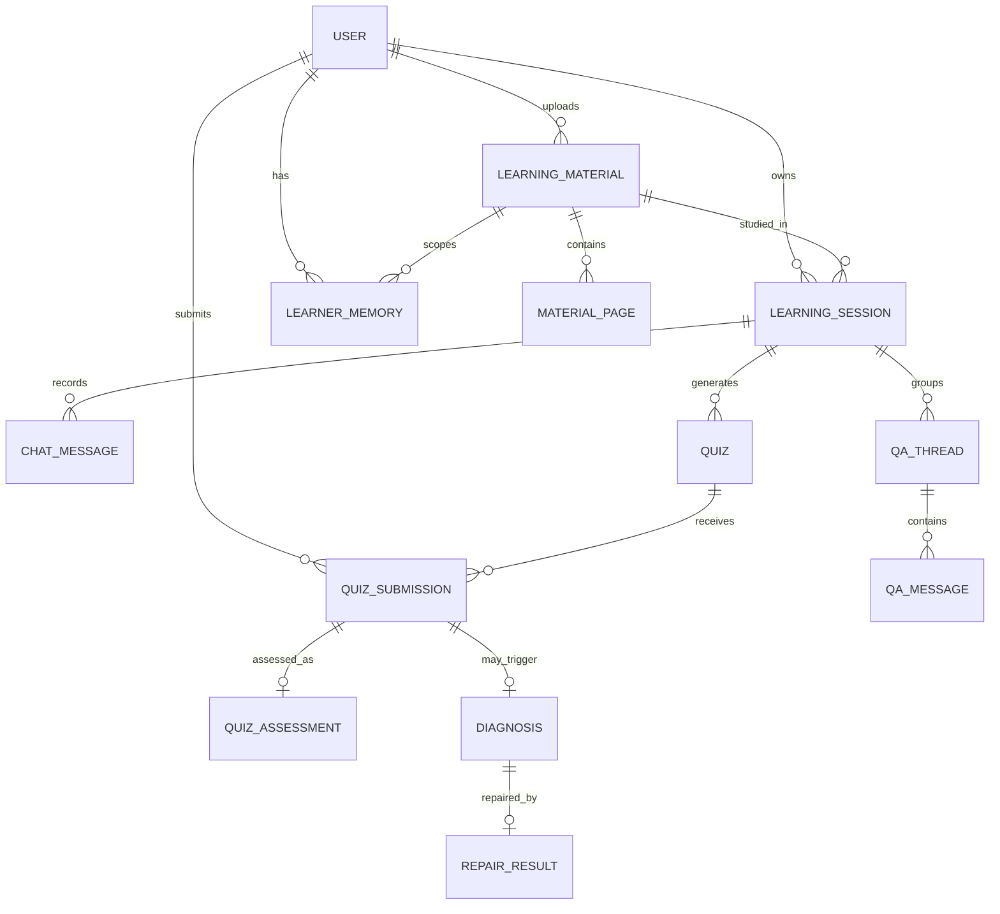

# 도메인 모델 문서

| 항목 | 내용 |
| --- | --- |
| 상태 | 초안 |
| 마지막 갱신 | 2026-07-31 |
| 범위 | Spring 소유 영속 도메인 |

## 1. 도메인 경계

| 도메인 | 주요 모델 | 책임 |
| --- | --- | --- |
| Identity | User | 인증 주체, 역할, 계정 상태 |
| Material | LearningMaterial, MaterialPage | PDF 메타데이터와 페이지 문맥 |
| Learning | LearningSession, ChatMessage | 현재 학습 상태와 대화 기록 |
| QA | QaThread, QaMessage | 이어지는 질문 문맥 |
| Quiz | Quiz, QuizSubmission, QuizAssessment | 문제 원본, 제출·채점, 내부 평가 |
| Repair | Diagnosis, RepairResult | 진단 질문과 오개념 교정 |
| Personalization | LearnerMemory | 반복 근거 기반 장기 개인화 정보 |

초기 계획에 언급된 Course, Lecture, Assignment, File, Notification은 현재 MVP 영속 모델에 포함하지 않습니다. 필요해지면 기존 `LearningMaterial`과의 경계를 먼저 합의합니다.

## 2. 엔티티 관계

## 3. 핵심 모델

### User

- 이메일은 중복될 수 없습니다.
- 비밀번호 원문을 저장하지 않습니다.
- 역할은 `LEARNER`, `INSTRUCTOR`, `ADMIN`입니다. 공개 가입은 `LEARNER | INSTRUCTOR`만 허용하고 `ADMIN`은 기능 미구현·예약 상태로 유지합니다(DEC-017, DEC-029 Proposed).
- `LEARNER`와 `INSTRUCTOR`는 현재 같은 학습 기능·소유권 규칙을 사용합니다. 강사 전용 도메인과 차등 권한은 #102에서 별도 정의합니다.
- 상태는 `ACTIVE`, `DELETED`입니다. 탈퇴(DEC-028)는 논리 삭제 + 즉시 익명화(email → `deleted_{id}`, name 고정 문구, password_hash 무효화)이며 복구는 MVP 미지원입니다. 유예 기간·물리 삭제 배치는 이후 개선안입니다.

### LearningMaterial

- PDF 파일과 학습용 메타데이터를 나타냅니다.
- 처리 상태는 `PROCESSING → READY | FAILED`이며 `READY`만 학습 가능합니다.
- 소유자만 조회·다운로드·삭제할 수 있고 삭제는 `ACTIVE → DELETED` 논리 전이입니다.
- 원본 물리 경로 대신 저장소 독립적인 `storageKey`를 저장하며, 삭제 시 파일과 페이지 문맥은 보존합니다.
- 비동기 추출 결과는 적용 직전에 상태를 다시 확인하고, 그 사이 삭제됐다면 폐기합니다.

### MaterialPage

- `(materialId, pageNumber)`는 유일합니다.
- 페이지 번호는 1부터 시작합니다.
- 추출 텍스트는 AI 문맥이며 원본 PDF의 유일한 표현으로 간주하지 않습니다.

### LearningSession

- 한 명의 사용자와 하나의 자료에 속합니다.
- `currentPage`는 자료의 유효 페이지 범위 안에 있어야 합니다.
- 세션의 전역 상태와 페이지별 학습 상태가 분리될 필요가 있는지 구현 전 검토합니다. 여러 페이지의 설명 이력을 정확히 보존해야 한다면 별도 `SessionPageProgress` 모델이 필요합니다.
- `conversationSummary`는 대화 요약이며 퀴즈 원본 저장소가 아닙니다.

### ChatMessage

- UI에 표시된 사용자·AI·시스템 메시지의 기준 기록입니다.
- `messageType`으로 일반 텍스트, 설명, QA, 진단, 교정을 구분합니다.
- 스트리밍 도중의 미완료 청크와 최종 메시지는 구분해야 합니다.

### QaThread / QaMessage

- 같은 페이지/설명/교정 문맥의 이어지는 질문을 묶습니다.
- 한 세션의 활성 스레드는 하나로 운영합니다. `START_NEW`는 기존 ACTIVE 스레드를 `CLOSED`로 바꾸고 새 스레드를 생성합니다.
- `FOLLOW_UP`은 같은 세션의 ACTIVE `qa-{id}`만 허용하며 타 세션·종료 스레드 참조는 정책 위반으로 거부합니다.
- AI 호출 전에 저장된 사용자 메시지와 최종 저장된 QA 메시지를 `qa_messages.chat_message_id`로 연결합니다.

### Quiz

- 생성 당시의 페이지 범위, 타입, 공개 문제, 비공개 정답/루브릭을 보존합니다.
- 문제 생성 이후 내용은 제출 이력의 재현성을 위해 수정하지 않는 것을 원칙으로 합니다.
- FE용 DTO에 정답/루브릭을 포함하지 않습니다.

### QuizSubmission

- 한 번의 사용자 답안과 채점 결과를 나타냅니다.
- 총점은 문항별 점수 합과 일치해야 하며 `0 <= score <= maxScore`입니다.
- MVP는 1회 제출 제한(DEC-009)이며 `attempt_no`는 1로 고정합니다. 재제출 확장 시 attempt 관리와 정답 보호 규칙을 함께 도입합니다.

### QuizAssessment

- 다음 턴 오케스트레이터용 내부 평가 메모입니다.
- 학습자에게 직접 보여주는 피드백과 구분합니다.
- 단일 Assessment를 장기 성향으로 확정하지 않습니다.

### Diagnosis / RepairResult

- 통과 기준 미달 제출만 진단을 시작할 수 있습니다.
- `PENDING → ANSWERED → COMPLETED` 순서로 진행합니다.
- 하나의 진단에는 최대 하나의 최종 RepairResult를 둡니다.

### LearnerMemory

- 사용자와 자료 범위별 장기 학습 정보를 저장하는 현재 초안입니다.
- 강점, 약점, 오개념, 설명 선호, 퀴즈 선호, 목표 난이도, 다음 코칭 목표를 관리합니다.
- 장기 메모리 갱신에는 반복 근거가 필요하며 근거 추적 방식은 구현 전 확정합니다.

## 4. 상태값

### LearningSession.status

| 상태 | 의미 | 허용 전이 |
| --- | --- | --- |
| ACTIVE | 학습 중 | COMPLETED, DELETED |
| COMPLETED | 학습 완료 | 없음 — MVP에서 재개 불가, 재학습은 새 세션 생성(DEC-024) |
| DELETED | 논리 삭제 | 없음 |

### pageStatus

| 상태 | 의미 |
| --- | --- |
| NOT_EXPLAINED | 현재 페이지 설명 전 |
| EXPLAINING | 설명 생성 중 |
| EXPLAINED | 설명 완료 |
| QUIZ_READY | 퀴즈 진행 가능 |
| DIAGNOSIS_PENDING | 진단 답변 대기 |
| REPAIR_COMPLETED | 오개념 교정 완료 |

MVP는 세션 단일 `pageStatus`를 유지하고 페이지 이동 시 초기화합니다(DEC-008 Accepted). 페이지별 이력 모델(`SessionPageProgress`) 분리는 MVP 이후 확장으로 미룹니다.

### QuizType

`MCQ`, `OX`, `SHORT`, `ESSAY`

### GradingVerdict

`CORRECT`, `PARTIAL`, `WRONG`

### Diagnosis.status

`PENDING → ANSWERED → COMPLETED`

- `PENDING`: 진단 질문 생성·표시 후 답변 대기.
- `ANSWERED`: 사용자의 진단 답변은 저장됐으나 교정(repair) 생성이 아직 완료되지 않은 중간 상태. 교정 턴이 실패하면 이 상태에 머무르며 재시도 대상이 된다.
- `COMPLETED`: 교정 결과 저장까지 완료.

정상 흐름에서 답변 저장과 교정 생성이 한 턴에 끝나면 `PENDING → COMPLETED`로 곧바로 전이할 수 있고, `ANSWERED`는 부분 실패 복구를 위한 상태다.

### LearnerMemory.targetDifficulty

`FOUNDATIONAL`, `BALANCED`, `CHALLENGING`

## 5. 주요 비즈니스 규칙

1. 모든 세션·퀴즈·진단 접근은 소유권을 검증합니다.
2. 페이지 이동은 LLM 없이 결정적으로 처리합니다.
3. FastAPI가 반환한 상태 패치는 Spring의 허용 목록과 전이 규칙을 통과해야 합니다.
4. MCQ/OX는 서버 저장 정답으로, SHORT/ESSAY는 루브릭 기반 AI 결과로 채점합니다.
5. 퀴즈 정답과 루브릭은 제출 전에 클라이언트에 노출하지 않습니다.
6. 저득점 교정 전에 진단 질문으로 막힌 지점을 확인합니다.
7. 교정 후 추가 질문은 QA 흐름으로 전환합니다.
8. 단일 관찰로 장기 학습자 메모리를 갱신하지 않습니다.
9. AI 결과와 그 근거가 된 퀴즈/진단 기록을 연결해 재현 가능하게 보존합니다.

