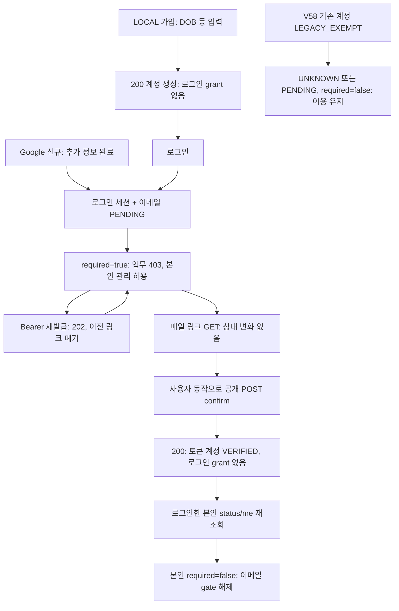

# FE 가입·DOB·이메일 확인 전달 계약 (#471 / #478 / #479)

이 문서는 **PR495 후보의 소비자 전달 자료**다. 현재 FE를 그대로 두고 이 후보의 BE만 배포하면 LOCAL 신규 가입은 DOB 누락 400, Google 신규 가입은 추가 정보 부족 409, 신규 미확인 계정의 업무 호출은 403으로 막힌다. 기존 계정은 V58의 `LEGACY_EXEMPT`로 이용을 유지한다. 새 계정의 gate를 우회하는 변경은 이 자료에 없다. FE 구현·배포 및 실제 메일 수신 검증은 별도 작업이다.

| 기준 | 정확한 head / 역할 |
| --- | --- |
| BE 계약 base, [PR495](https://github.com/AutoAI-UTEUM/BE/pull/495) | `ee69e4259b1b80871fdc1805a7b42d8628ac57e9` / PR500 보존 후 가입·V58·이메일 gate 구현 후보 |
| 확인한 BE upstream `develop` | `ef8f0f74a3d2d46a0adc9aabf1d9dad9577dd938` / PR500 merge, 최신 후보의 조상 |
| 읽기 전용 FE `develop` | `1b6987d8472a064a080a00bd43232993e9bd41eb` |
| 독립 브랜치 | `feature/471-fe-auth-contract` — 가입·DOB·이메일 계약을 기존 문서에 연결하고 FE 소비자 누락을 오프라인 재현한다. |

이 브랜치는 PR495 위에 문서·검증만 쌓는다. 최초 확인 후보 `b6f4f5f3155f8e1799698bcdea956fbd64f22d61`에서 최신 후보로 fast-forward했고 차이는 PR500의 AI 테스트 자료 3개뿐이다. `main-service` tree는 같아 계약 구현은 변하지 않았다. head가 바뀌면 이 표의 기준과 검증 결과를 다시 확인한다.

## 기존 자료와 읽는 순서

기능·DB 설명을 중복 작성하지 않는다. [API 명세](../../api-spec.md), [화면 매핑](../../screen-api-map.md), [이메일 확인](../../email-verification.md), [DOB 기반](../../birthdate-guardian-foundation.md), [기존 계정 정책](../../legacy-account-access.md), [메일 outbox](../../mail-outbox.md), [보호자 웹/SMS 기반](../../guardian-web-sms-intake.md)을 재사용한다. 이 문서는 DTO/controller/gate/migration과 기존 회귀 테스트를 읽어 FE가 구현해야 할 차이만 모은다.

배포 순서·설정·rollback 조건은 별도 [PR501](https://github.com/AutoAI-UTEUM/BE/pull/501)의 [배포 사전 점검 문서](https://github.com/AutoAI-UTEUM/BE/blob/fd12b01ecfef34b45629e2a8efe4068a4b5861c1/docs/launch-deployment-preflight.md)를 재사용한다. 해당 문서는 아직 이 base에 합쳐지지 않아 exact head 링크로 연결한다.

초기 단위에서 발견한 문서 차이는 최종 통합의 공통 문서 정합성 작업으로 보완한다. LOCAL·새 Google 예시에 DOB를 넣고, 이메일·DOB·DB 문서의 V58 기존 이용 예외와 현재 동의 대상 없는 경우의 동작을 실제 코드/기존 테스트에 맞춘다. `UNKNOWN/PENDING + emailVerificationRequired=false`는 확인 성공 표시가 아니며 false만으로 cohort를 추정할 수도 없다. 발견 시점과 근거는 [증거 기록](EVIDENCE.md)에 보존한다. 이 원래 독립 단위의25개 검사는 runtime·FE 화면 인수 완료를 뜻하지 않는다.

## HTTP 입력·출력

모든 URL은 Spring 기준 상대 경로다. JSON 요청은 `Content-Type: application/json`으로 보낸다. 인증된 본인 호출은 `Authorization: Bearer <accessToken>`을 사용한다. refresh 쿠키만으로 `request/status` 인증을 대신할 수 없다. 공통 성공은 `{ "success": true, "data": ..., "message": "요청이 성공했습니다." }`, 실패는 `{ "success": false, "error": { "code": "...", "message": "...", "details": [] }, "traceId": "...", "timestamp": "..." }`다. FE 분기는 문자열 안내문 대신 `error.code`와 HTTP 상태를 사용한다.

| Endpoint | 인증 / 입력 | 성공 / FE 의미 |
| --- | --- | --- |
| `POST /api/auth/signup` | 공개 / 아래 LOCAL DTO | **200**, `SignupResponse`. 가입 성공은 이메일 확인 전 계정 생성이며 access token·refresh 쿠키·로그인 세션을 발급하지 않는다. |
| `POST /api/auth/google` | 공개 / `idToken` + 신규 추가 정보 | **200**, `LoginResponse`와 refresh 쿠키. 신규 계정은 로그인했어도 이메일 `PENDING`이며 업무 접근은 아직 차단된다. |
| `POST /api/auth/login` | 공개 / `email`, `password` | **200**, `LoginResponse`와 refresh 쿠키. 이메일 확인 대기여도 로그인 가능하다. |
| `GET /api/users/me` | Bearer / 본인 | **200**, `UserResponse`. 확인 후 현재 로그인 계정의 상태를 다시 얻는다. |
| `GET /api/auth/email-verification/status` | Bearer / body 없음 | **200**, `EmailVerificationResponse`, `Cache-Control: no-store`. |
| `POST /api/auth/email-verification/request` | Bearer / body 없음 | **202**, `data: null`, `Cache-Control: no-store`. 본인에게 링크 발급을 요청한 결과이며 실제 발송·수신 완료나 인증 성공을 보장하지 않는다. |
| `POST /api/auth/email-verification/confirm` | 공개 / `{ "token": "<43자 Base64URL>" }` | **200**, `EmailVerificationResponse`, `Cache-Control: no-store`. 토큰에 연결된 계정만 확인한다. 로그인 grant·쿠키를 발급하지 않는다. |
| `GET /api/auth/email-verification/confirm` | 공개 / query에 토큰을 보내도 소비 없음 | **405** `METHOD_NOT_ALLOWED`, `Allow: POST`, `Cache-Control: no-store`. 메일 열기와 확인 POST를 구분한다. |

LOCAL 가입 입력:

| 필드 | 계약 |
| --- | --- |
| `email` | 필수, 이메일 형식·최대 255자. FE는 trim/lowercase 후 전송하고 BE도 정규화한다. |
| `password` | 필수, 8–64자, 영문·숫자 각 1자 이상. 응답에 없다. |
| `name` | 필수, 공백만 불가·최대 100자, BE 저장 시 trim. |
| `role` | 필수, `LEARNER` 또는 `INSTRUCTOR`. 공개 가입에서 ADMIN/USER 불가. |
| `dateOfBirth` | **신규 필수**, JSON 날짜 문자열 `YYYY-MM-DD`, 날짜형 `LocalDate`. 저장 연도 1–9999. 응답·AI DTO에 없다. |
| `affiliation` | 선택, 최대 100자, trim 후 빈 값은 null. |
| `learningEmailOptIn` | 선택 boolean, 생략/null이면 false. 가입 확인 메일 요청 및 필수 동의와 별개다. |
| `consents` | 현재 정책의 `requiresConsent=true` 항목에 대한 `{type, version}` 배열. 버전을 고정하지 않고 `GET /api/policies/current`에서 얻는다. 아래 동의 규칙을 따른다. |

Google 첫 요청은 `{"idToken":"..."}`로 가능하다. 기존 **같은 Google subject** 계정이면 DOB·role·가입 consents 재입력 없이 로그인하며 보낸 DOB도 기존 값을 덮어쓰지 않는다. 기존 계정 조회는 신규 입력 검사보다 먼저다. 연결되지 않은 subject의 이메일이 기존 계정과 충돌하면 추가 가입 폼 대신 `EMAIL_ALREADY_EXISTS`로 거부한다. 자동 연결·세션 발급은 없다.

비충돌 신규 계정은 `role`, `dateOfBirth`, 필요한 `consents`와 같은 `idToken`을 `/api/auth/google`에 다시 보낸다. `affiliation`, `learningEmailOptIn`도 선택이다. 신규 role 부재는 `SIGNUP_REQUIRED`, 알 수 없는 role 문자열은 `VALIDATION_FAILED`다. Google에서는 role·동의 검사가 DOB 검사보다 먼저여서 여러 누락이 있으면 오류 우선순위가 달라질 수 있다. 만료된 ID 토큰은 공급자 인증을 다시 받아야 하며 FE가 무한 재요청하지 않는다. Google 검증 이메일도 이 후보에서는 BE 확인 링크를 거쳐야 한다.

DOB는 사용자 입력 저장만 구현돼 있다. 미래 날짜 제한, 정정 API, 나이 계산 기준일/시간대·윤년 생일·보호자 승인 절차는 확정되지 않았다. 화면이 DOB만 보고 성인/만14세 이상/보호자 승인 상태를 만들면 안 된다.

현재 가입 동의 설정 기본값은 false다. 동의 대상 정책이 있으면 설정 true일 때 누락/빈 배열을 거부하고, 설정 false일 때 생략/빈 배열은 가능하다. 배열을 제출하면 현재 `requiresConsent=true` 항목의 정확한 버전을 한 번씩 보내야 한다. 누락·중복·버전 오류는 `POLICY_CONSENT_REQUIRED`다. 동의 비대상 문서는 열람 안내를 제공하고 배열에 넣지 않는다. 동의 대상이 아예 없는 경우에는 현재 런타임·기존 테스트가 설정 true여도 가입을 허용한다. 이 작업에서 해당 정책이나 defaults를 바꾸지 않는다.

응답 DTO는 다음처럼 다르다. 모든 성공 데이터의 정확한 합성 예시는 [fixtures.json](fixtures.json)에 있다.

| DTO / 위치 | `data` 필드 |
| --- | --- |
| `SignupResponse` / LOCAL 가입 | `userId`, `email`, `name`, `role`, nullable `affiliation`, nullable `avatarUrl`, `learningEmailOptIn`, `emailVerification`, `emailVerificationRequired` |
| `UserResponse` / `me`, 로그인 `data.user` | `id`, `email`, `name`, `role`, nullable `affiliation`, nullable `avatarUrl`, `learningEmailOptIn`, `emailVerification`, `emailVerificationRequired`, nullable `emailVerifiedAt` |
| `LoginResponse` / LOCAL·Google 로그인 | `accessToken`, `tokenType: "Bearer"`, `expiresIn`(초), `user`, `session`, `pendingConsents` |
| `session` | `absoluteExpiresAt`, `idleExpiresAt`, `idleTimeoutSeconds`; 서버값을 사용한다. |
| `EmailVerificationResponse` / status·confirm | `emailVerification: "UNKNOWN" | "PENDING" | "VERIFIED"`, `emailVerificationRequired: boolean`, `emailVerifiedAt: ISO Instant | null` |

`SignupResponse`에는 `emailVerifiedAt`이 없다. `cohort`, DOB, guardian/age 상태는 위 DTO에 노출되지 않는다. 특히 `emailVerificationRequired=false`만 보고 LEGACY_EXEMPT라고 추정할 수도 없다. VERIFIED 계정도 false다.

## 오류와 화면 처리

| HTTP / code | 조건 / FE 처리 |
| --- | --- |
| 400 `VALIDATION_FAILED` | LOCAL DOB 누락/null, 필드 제약, token 형식(누락·공백·43자 Base64URL 불일치), 신규 Google 잘못된 role, 저장 가능한 연도 범위 위반. `details[{field,reason}]`는 있을 수도, 비어 있을 수도 있다. DOB 필드를 오류 매핑 목록에 추가한다. |
| 400 `MALFORMED_REQUEST` | 잘못된 JSON·날짜 문자열·enum 등 역직렬화 실패. “날짜형 입력 오류=항상 VALIDATION_FAILED”로 처리하지 않는다. |
| 400 `POLICY_CONSENT_REQUIRED` | 현재 필요한 가입 동의 누락·중복·버전 불일치. 정책을 다시 조회하고 사용자 동의를 받는다. |
| 409 `SIGNUP_REQUIRED` | 비충돌 Google 신규 계정에 role/DOB 등 추가 입력 필요. 별도 상세 missing-field 목록을 응답하지 않는다. |
| 409 `EMAIL_ALREADY_EXISTS` | LOCAL 중복 또는 Google subject 이메일 충돌. 충돌을 추가 가입 필요/인증 토큰 오류와 구별한다. |
| 400 `EMAIL_VERIFICATION_TOKEN_INVALID` | 유효한 형식이지만 존재하지 않음·정확한 만료 경계 및 이후·재사용·재발급으로 폐기·탈퇴·현재 이메일 불일치. 같은 “유효하지 않거나 만료된 링크” 안내를 사용한다. |
| 401 `AUTHENTICATION_REQUIRED` | request/status/me Bearer 누락. 로그인 안내를 제공한다. |
| 401 `TOKEN_INVALID` / `TOKEN_EXPIRED` | access 인증 실패/만료; 기존 refresh/세션 만료 처리를 유지한다. Google 토큰 검증/통신 실패도 TOKEN_INVALID다. |
| 401 `ACCOUNT_SUSPENDED`, 403 `USER_INACTIVE` | 계정 정지/탈퇴·비활성. legacy 예외도 이 제한을 풀지 않는다. 공개 confirm의 해당 계정 상태는 TOKEN_INVALID 계열 안내 대신 `EMAIL_VERIFICATION_TOKEN_INVALID`로 통일한다. |
| 403 `EMAIL_VERIFICATION_REQUIRED` | 신규 미확인 계정의 자료·강의실·학습·파일·SSE·퀴즈·노트·리포트 등 업무 접근. 세션은 유지하고 확인 안내로 이동한다. 자동 refresh·logout·업무 요청 무한 반복을 하지 않는다. |
| 429 `RATE_LIMIT_EXCEEDED` | 이메일 재요청 또는 confirm 제한. 일반 로그인 제한 `LOGIN_RATE_LIMITED`와 별개. 이 후보의 이메일 제한 오류에는 `Retry-After`가 없으므로 정확한 남은 초를 만들지 않는다. |
| 405 `METHOD_NOT_ALLOWED` | GET confirm. `Allow: POST`; GET/페이지 진입으로 상태를 소비하지 않는다. |
| 415 `UNSUPPORTED_MEDIA_TYPE` | JSON endpoint에 맞지 않는 Content-Type. |
| 403 `AGE_VERIFICATION_REQUIRED` / `GUARDIAN_VERIFICATION_PENDING` | 현재는 내부 age gate의 거부 코드. 전역 HTTP/SSE/AI 연결 완료를 의미하지 않는다. 향후 노출돼도 이메일 성공으로 우회하지 않는다. |

이메일 3개 API의 **성공**은 no-store다. GET confirm의 405도 no-store지만 공통 validation/429 등 모든 실패에 그 헤더가 있다는 계약은 없다. 메일 발송 비활성·비동기 provider 실패·발송 원장 상한은 202 이후에도 발생할 수 있고, 원문 token·delivery ID·만료시각은 응답하지 않는다. 화면은 “수신 완료” 대신 요청 접수 안내를 표시한다.

## 재발송·만료·일회성과 상태 전이

토큰은 32바이트 난수의 Base64URL 43자이며 **발급 시각 + 30분**이 만료시각이다. 수신/페이지 진입 시각부터 30분이 아니다. `now == expiresAt`도 거부한다. 가입·재발급 시 이전 미사용 링크를 무효화하고, 정상 확정은 1회만 성공한다. 동시 확정은 하나가 200, 나머지는 400이다. 재발급/확정/탈퇴는 사용자→토큰 잠금 순서로 직렬화된다. 이 동시성 검증은 기존 BE 테스트에 있고 이번 소비자 mock 실행이 DB 경합을 검증한 것은 아니다.

재요청은 사용자당 **3회/시간**, IP당 **10회/시간**이고 confirm은 IP당 **10회/15분**이다. 이메일용 별도 인메모리 limiter이며 가입 최초 발급은 재요청 횟수 검사를 호출하지 않는다. VERIFIED 계정의 재요청은 새 token·메일 없이 202이며 limiter 검사 전에 반환한다. mail outbox의 DB 발송 예약 제한은 별도로 적용된다. 재요청 버튼은 연속 클릭을 막고 429 이후 사용자의 재시도를 기다린다.



| 이벤트 | 계정/화면 상태 |
| --- | --- |
| 신규 LOCAL·Google 생성 | `NEW_SIGNUP`, 이메일 PENDING, 확인시각 null, required=true. DOB 저장만으로 guardian/age UNKNOWN을 승인으로 바꾸지 않는다. |
| 신규 UNKNOWN이나 PENDING | required=true. 오래된 생성시각·DOB 누락은 예외 근거가 아니다. |
| 기존 계정 V58 적용 | LEGACY_EXEMPT, 기존 DOB/age/email 증거 보존. UNKNOWN/PENDING에서도 required=false. DOB 재입력 강제 없음. |
| 기존 미확인 계정의 자발적 재발급 | 이메일 PENDING으로 전이하되 기존 이용 예외 유지(required=false). |
| 로그인·refresh·비밀번호 재설정 | 이메일 확인 증거를 만들지 않는다. |
| 정상 confirm | token의 현재 활성 계정 VERIFIED + 확인시각. 다른 로그인 계정을 확인했다고 표시하지 않는다. |
| 만료·재사용·이메일 불일치·탈퇴 후 confirm | 400 동일 오류, 확인 증거 없음. |
| 탈퇴 | 기존 token 거부, DOB 제거·이메일 UNKNOWN/확인시각 null. legacy 예외로 탈퇴/정지를 허용하지 않는다. |

확인 전에도 로그인·refresh·활동 갱신·로그아웃, 본인 `me`(조회/수정/탈퇴), password/preferences/avatar/consents, 공개 정책/health를 사용할 수 있다. 역할·소유권·강의실 멤버십·정지·탈퇴·정책 동의 검사는 계속 적용된다. 확인 후 같은 JWT로 현재 상태를 다시 읽을 수 있으므로 token 변경을 성공 조건으로 삼지 않는다. 전역 age/guardian gate 및 승인 endpoint는 이 후보에서 완성되지 않았고 `PHONE_CONFIRMED`도 연령/관계/보호자 승인 근거가 아니다.

## 합성 예시

[fixtures.json](fixtures.json)의 이름과 표를 함께 사용한다. 모든 이메일은 `example.invalid`, ID는 합성이고 Google/access/refresh 값도 실제 인증에 쓸 수 없는 문자열이다. `synthetic-1` 정책 버전은 가짜 현재 정책 응답에서만 사용한다.

LOCAL 요청 예시:

```json
{"email":"contract-learner@example.invalid","password":"Synthetic123!","name":"합성 학습자","role":"LEARNER","dateOfBirth":"2015-01-02","learningEmailOptIn":false}
```

동의 필수인 합성 시나리오에서는 `consents:[{"type":"TERMS","version":"synthetic-1"}]`도 추가한다. 생년월일이 만14세 미만인 예시도 승인/이용 가능 판정을 하지 않는다.

```json
{"success":true,"data":{"emailVerification":"PENDING","emailVerificationRequired":true,"emailVerifiedAt":null},"message":"요청이 성공했습니다."}
```

```json
{"success":true,"data":{"emailVerification":"UNKNOWN","emailVerificationRequired":false,"emailVerifiedAt":null},"message":"요청이 성공했습니다."}
```

첫 응답은 신규 확인 필요, 둘째는 기존 이용 예외의 예시다. 둘째를 VERIFIED로 변환하지 않는다. confirm 성공에는 user ID/이메일도 없으므로 **현재 로그인 계정이 링크 계정과 같다고 가정하면 안 된다**. 현재 세션의 status/me 결과로만 해당 화면의 접근 안내를 갱신한다. 익명 확인 후에는 로그인 안내를 제공한다.

## FE 구현 체크리스트

- [ ] `SignupFormValues`·`GoogleAuthValues`에 신규 DOB, 화면 입력/날짜 오류 안내를 추가하고 LOCAL 및 Google **신규 재요청** body에 전달한다. 기존 Google 로그인에는 DOB를 강제하지 않는다.
- [ ] `authRepository`의 body builder와 `FORM_FIELDS`에 DOB를 연결한다. 상세 필드 배열이 비어 있는 오류, MALFORMED_REQUEST도 안내한다.
- [ ] 현재 정책 조회/전문 열람·대상 consent 선택을 LOCAL/Google 신규 입력과 연결한다. 정책 버전/기본값을 FE가 임의 변경하지 않는다.
- [ ] `AuthUser`, login/me DTO mapper에 이메일 상태 3필드를 보존한다. signup의 `userId`와 me/login의 `id`, signup의 확인시각 부재를 구별한다. 구형 BE 응답에 필드가 없으면 UNKNOWN/VERIFIED/legacy 상태를 임의로 만들지 않고 지원 여부를 명시한다.
- [ ] 공개 `/verify-email?token=` route를 추가한다. 익명/로그인 사용자가 모두 열 수 있고 페이지 GET·mount·prefetch만으로 confirm을 실행하지 않는다. 명시적 확인 버튼으로 1회 POST하고 중복 제출을 막는다.
- [ ] query token은 확인 동작에 필요한 메모리에만 유지한다. URL에서 빨리 제거하고 성공·실패 종료 후 메모리에서도 지운다. 브라우저 영속 저장·분석/오류 로그·return-target URL에 넣지 않는다. URL/history 제거와 외부 referrer 유출 방지 여부는 FE에서 검증한다.
- [ ] request/status repository 함수를 Bearer 본인 호출로 추가한다. 로그인 전 재발급은 로그인 안내로 보낸다. 202/null, 메일 비활성/지연, 429와 헤더 부재를 처리한다.
- [ ] confirm 성공 후 현재 로그인 계정 status/me를 재조회한다. 다른 계정 링크, 다른 탭 확인·로그아웃·계정 전환 및 늦게 도착한 응답을 처리한다. 익명 confirm으로 세션을 만들지 않는다.
- [ ] LOCAL 가입 후 자동 로그인 또는 Google 로그인 성공 직후, 현재 사용자 응답의 `emailVerificationRequired=true`면 확인 안내를 보여 준다. 기존 `SignupPage`의 무조건 강의실 이동을 점검한다.
- [ ] JSON 업무 호출과 raw PDF/SSE 오류에서 `EMAIL_VERIFICATION_REQUIRED`를 공통 처리한다. 세션/계정 관리 화면은 유지하고 업무 요청 반복·예외 권한 생성은 하지 않는다.
- [ ] UNKNOWN/PENDING + required=false인 기존 이용 예외를 유지한다. 이메일 완료 표시, 연령/guardian/AI 동의 완료 표시를 만들지 않는다.
- [ ] 합성 mock으로 아래 시나리오와 브라우저 E2E를 FE 저장소에서 검증하고 정확 FE head를 반환한다. 실Google/메일/SMS/실계정/실DEV DB 검증은 이 작업의 실행 목록에 없다.

FE 인수 시나리오: LOCAL DOB 없음/잘못된 날짜/정상 계정 생성, Google 기존 로그인/신규 추가 정보/이메일 충돌, PENDING 로그인 후 JSON·PDF·SSE 403, request 202/null/429, 링크 GET 비소비/수동 POST, 만료·이전 링크·재사용 같은 오류, 익명 확인 후 로그인, 다른 계정 링크 확정 뒤 본인 재조회, UNKNOWN/PENDING 기존 이용 예외, 확인 후 타인 리소스/정지·탈퇴 거부, 정책 동의 유지, 두 탭/중복 클릭/계정 전환·늦은 응답.

## 경량 검증 실행과 의미

Node **24.12.0**에서 의존성 설치 없이 실행했다. `stripTypeScriptTypes`를 제공하는 Node 22.13+도 사용 가능하지만 다른 버전의 실행 결과는 기록하지 않았다. repository root에서:

```powershell
# BE source/fixture/link 검사만 (FE 검사 파일을 실행하지 않음)
node --disable-warning=ExperimentalWarning --test docs/qa/fe-auth-contract/contract.test.mjs

# 읽기 전용으로 검증할 FE clone의 경로를 지정
$env:FE_AUTH_SOURCE_ROOT = 'C:\path\to\FE-readonly'
node --disable-warning=ExperimentalWarning --test docs/qa/fe-auth-contract/contract.test.mjs docs/qa/fe-auth-contract/consumer.test.mjs
```

`contract.test.mjs`는 DTO record 필드·오류 상태·route/legacy/기간의 **소스 대조**와 합성 fixture·링크 검사를 한다. Java/Spring을 실행하지 않는다. `consumer.test.mjs`는 실제 FE API client·raw client·error/envelope·authRepository TypeScript를 읽고 Node로 변환해 가짜 fetch에 연결한다. 서버/socket·provider를 열지 않고 FE 파일도 쓰지 않는다. React/router의 동작이나 쿠키 저장은 실행하지 않는다.

`KNOWN GAP` 검사는 현재 소비자의 누락을 기대 결과로 고정해 재현한다. **전체 통과는 FE 호환성 승인·Spring 런타임 통과를 뜻하지 않는다.** FE head가 바뀌면 고정된 head 검사/누락 검사가 실패하도록 되어 있다. 후속 FE는 이 fixture로 실제 입력 전달·상태 보존·화면 전이를 검증하는 인수 테스트를 추가해야 한다. 이 자료 자체의 통과/미실행과 기존 서버 테스트 근거는 [EVIDENCE.md](EVIDENCE.md)에 구분한다.

Related to [#471](https://github.com/AutoAI-UTEUM/BE/issues/471), [#478](https://github.com/AutoAI-UTEUM/BE/issues/478), [#479](https://github.com/AutoAI-UTEUM/BE/issues/479). develop/main 반영·merge·배포 결과를 기록한 문서는 아니다.
